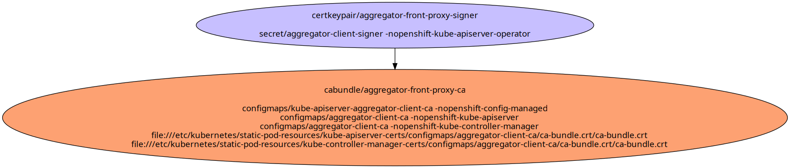

# Aggregated API Server Certificates

Used to secure connections between the kube-apiserver and aggregated API Servers.

- [Signing Certificate/Key Pairs](#signing-certificatekey-pairs)
    - [aggregator-front-proxy-signer](#aggregator-front-proxy-signer)
- [Serving Certificate/Key Pairs](#serving-certificatekey-pairs)
- [Client Certificate/Key Pairs](#client-certificatekey-pairs)
    - [aggregator-front-proxy-client](#aggregator-front-proxy-client)
- [Certificates Without Keys](#certificates-without-keys)
- [Certificate Authority Bundles](#certificate-authority-bundles)
    - [aggregator-front-proxy-ca](#aggregator-front-proxy-ca)

## Signing Certificate/Key Pairs

### aggregator-front-proxy-signer

Signer for the kube-apiserver to create client certificates for aggregated apiservers to recognize as a front-proxy.

| Property | Value |
| ----------- | ----------- |
| Type | Signer |
| CommonName | aggregator-signer |
| SerialNumber | 8209157924322867463 |
| Issuer CommonName | [aggregator-front-proxy-signer](#aggregator-front-proxy-signer) |
| Validity | 24h |
| Signature Algorithm | SHA256-RSA |
| PublicKey Algorithm | RSA 2048 bit |
| Usages | - KeyUsageDigitalSignature - KeyUsageKeyEncipherment - KeyUsageCertSign |
| ExtendedUsages |  |

#### aggregator-front-proxy-signer Locations
| Namespace | Secret Name |
| ----------- | ----------- |
| openshift-kube-apiserver-operator | aggregator-client-signer |

| File | Permissions | User | Group | SE Linux |
| ----------- | ----------- | ----------- | ----------- | ----------- |

## Serving Certificate/Key Pairs

## Client Certificate/Key Pairs

### aggregator-front-proxy-client

Client certificate used by the kube-apiserver to communicate to aggregated apiservers.

| Property | Value |
| ----------- | ----------- |
| Type | Client |
| CommonName | system:openshift-aggregator |
| SerialNumber | 8112884492387709090 |
| Issuer CommonName | [aggregator-front-proxy-signer](#aggregator-front-proxy-signer) |
| Validity | 23h |
| Signature Algorithm | SHA256-RSA |
| PublicKey Algorithm | RSA 2048 bit |
| Usages | - KeyUsageDigitalSignature - KeyUsageKeyEncipherment |
| ExtendedUsages | - ExtKeyUsageClientAuth |
| Organizations (User Groups) |  |

#### aggregator-front-proxy-client Locations
| Namespace | Secret Name |
| ----------- | ----------- |
| openshift-kube-apiserver | aggregator-client |

| File | Permissions | User | Group | SE Linux |
| ----------- | ----------- | ----------- | ----------- | ----------- |
| /etc/kubernetes/static-pod-resources/kube-apiserver-certs/secrets/aggregator-client/tls.crt/tls.crt | -rw-------. | root | root | system_u:object_r:kubernetes_file_t:s0 |
| /etc/kubernetes/static-pod-resources/kube-apiserver-certs/secrets/aggregator-client/tls.crt/tls.key | -rw-------. | root | root | system_u:object_r:kubernetes_file_t:s0 |

## Certificates Without Keys

These certificates are present in certificate authority bundles, but do not have keys in the cluster.
This happens when the installer bootstrap clusters with a set of certificate/key pairs that are deleted during the
installation process.

## Certificate Authority Bundles

### aggregator-front-proxy-ca

CA for aggregated apiservers to recognize kube-apiserver as front-proxy.

**Bundled Certificates**

| CommonName | Issuer CommonName | Validity | PublicKey Algorithm |
| ----------- | ----------- | ----------- | ----------- |
| [aggregator-front-proxy-signer](#aggregator-front-proxy-signer) | [aggregator-front-proxy-signer](#aggregator-front-proxy-signer) | 24h | RSA 2048 bit |

#### aggregator-front-proxy-ca Locations
| Namespace | ConfigMap Name |
| ----------- | ----------- |
| openshift-config-managed | kube-apiserver-aggregator-client-ca |
| openshift-kube-apiserver | aggregator-client-ca |
| openshift-kube-controller-manager | aggregator-client-ca |

| File | Permissions | User | Group | SE Linux |
| ----------- | ----------- | ----------- | ----------- | ----------- |
| /etc/kubernetes/static-pod-resources/kube-apiserver-certs/configmaps/aggregator-client-ca/ca-bundle.crt/ca-bundle.crt | -rw-r--r--. | root | root | system_u:object_r:kubernetes_file_t:s0 |
| /etc/kubernetes/static-pod-resources/kube-controller-manager-certs/configmaps/aggregator-client-ca/ca-bundle.crt/ca-bundle.crt | -rw-r--r--. | root | root | system_u:object_r:kubernetes_file_t:s0 |

