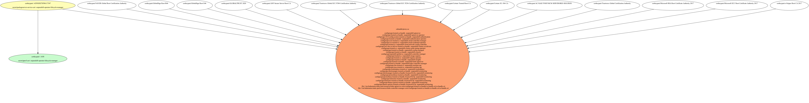
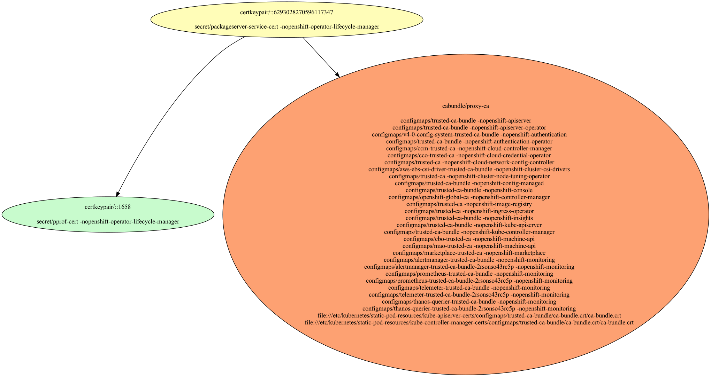
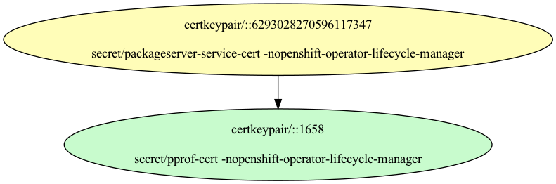
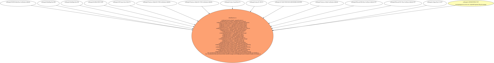

# Proxy Certificates

Used by the OpenShift platform to recognize the proxy.  Other usages are side-effects which work by accident and not by principled design.

- [Signing Certificate/Key Pairs](#signing-certificatekey-pairs)
    - 
- [Serving Certificate/Key Pairs](#serving-certificatekey-pairs)
    - 
- [Client Certificate/Key Pairs](#client-certificatekey-pairs)
    - 
    - 
- [Certificates Without Keys](#certificates-without-keys)
    - [AC RAIZ FNMT-RCM SERVIDORES SEGUROS](#ac-raiz-fnmt-rcm-servidores-seguros)
    - [ANF Secure Server Root CA](#anf-secure-server-root-ca)
    - [Certum EC-384 CA](#certum-ec-384-ca)
    - [Certum Trusted Root CA](#certum-trusted-root-ca)
    - [GLOBALTRUST 2020](#globaltrust-2020)
    - [GlobalSign Root E46](#globalsign-root-e46)
    - [GlobalSign Root R46](#globalsign-root-r46)
    - [Microsoft ECC Root Certificate Authority 2017](#microsoft-ecc-root-certificate-authority-2017)
    - [Microsoft RSA Root Certificate Authority 2017](#microsoft-rsa-root-certificate-authority-2017)
    - [NAVER Global Root Certification Authority](#naver-global-root-certification-authority)
    - [Trustwave Global Certification Authority](#trustwave-global-certification-authority)
    - [Trustwave Global ECC P256 Certification Authority](#trustwave-global-ecc-p256-certification-authority)
    - [Trustwave Global ECC P384 Certification Authority](#trustwave-global-ecc-p384-certification-authority)
    - [e-Szigno Root CA 2017](#e-szigno-root-ca-2017)
- [Certificate Authority Bundles](#certificate-authority-bundles)
    - [proxy-ca](#proxy-ca)

## Signing Certificate/Key Pairs

### 

| Property | Value |
| ----------- | ----------- |
| Type | Signer,Serving,Client |
| CommonName |  |
| SerialNumber | 6293028270596117347 |
| Issuer CommonName |  |
| Validity | 2y |
| Signature Algorithm | ECDSA-SHA256 |
| PublicKey Algorithm | ECDSA 256 bit, P-256 curve |
| Usages | - KeyUsageDigitalSignature - KeyUsageCertSign |
| ExtendedUsages | - ExtKeyUsageClientAuth - ExtKeyUsageServerAuth |
| Organizations (User Groups) | - Red Hat, Inc. |
| DNS Names | - packageserver-service.openshift-operator-lifecycle-manager - packageserver-service.openshift-operator-lifecycle-manager.svc |
| IP Addresses |  |

####  Locations
| Namespace | Secret Name |
| ----------- | ----------- |
| openshift-operator-lifecycle-manager | packageserver-service-cert |

| File | Permissions | User | Group | SE Linux |
| ----------- | ----------- | ----------- | ----------- | ----------- |

## Serving Certificate/Key Pairs

### 

| Property | Value |
| ----------- | ----------- |
| Type | Signer,Serving,Client |
| CommonName |  |
| SerialNumber | 6293028270596117347 |
| Issuer CommonName |  |
| Validity | 2y |
| Signature Algorithm | ECDSA-SHA256 |
| PublicKey Algorithm | ECDSA 256 bit, P-256 curve |
| Usages | - KeyUsageDigitalSignature - KeyUsageCertSign |
| ExtendedUsages | - ExtKeyUsageClientAuth - ExtKeyUsageServerAuth |
| Organizations (User Groups) | - Red Hat, Inc. |
| DNS Names | - packageserver-service.openshift-operator-lifecycle-manager - packageserver-service.openshift-operator-lifecycle-manager.svc |
| IP Addresses |  |

####  Locations
| Namespace | Secret Name |
| ----------- | ----------- |
| openshift-operator-lifecycle-manager | packageserver-service-cert |

| File | Permissions | User | Group | SE Linux |
| ----------- | ----------- | ----------- | ----------- | ----------- |

## Client Certificate/Key Pairs

### 

| Property | Value |
| ----------- | ----------- |
| Type | Signer,Serving,Client |
| CommonName |  |
| SerialNumber | 6293028270596117347 |
| Issuer CommonName |  |
| Validity | 2y |
| Signature Algorithm | ECDSA-SHA256 |
| PublicKey Algorithm | ECDSA 256 bit, P-256 curve |
| Usages | - KeyUsageDigitalSignature - KeyUsageCertSign |
| ExtendedUsages | - ExtKeyUsageClientAuth - ExtKeyUsageServerAuth |
| Organizations (User Groups) | - Red Hat, Inc. |
| DNS Names | - packageserver-service.openshift-operator-lifecycle-manager - packageserver-service.openshift-operator-lifecycle-manager.svc |
| IP Addresses |  |

####  Locations
| Namespace | Secret Name |
| ----------- | ----------- |
| openshift-operator-lifecycle-manager | packageserver-service-cert |

| File | Permissions | User | Group | SE Linux |
| ----------- | ----------- | ----------- | ----------- | ----------- |

### 

| Property | Value |
| ----------- | ----------- |
| Type | Client |
| CommonName |  |
| SerialNumber | 1658 |
| Issuer CommonName |  |
| Validity | 60m |
| Signature Algorithm | SHA256-RSA |
| PublicKey Algorithm | RSA 4096 bit |
| Usages | - KeyUsageDigitalSignature |
| ExtendedUsages | - ExtKeyUsageClientAuth |
| Organizations (User Groups) | - Red Hat, Inc. |

####  Locations
| Namespace | Secret Name |
| ----------- | ----------- |
| openshift-operator-lifecycle-manager | pprof-cert |

| File | Permissions | User | Group | SE Linux |
| ----------- | ----------- | ----------- | ----------- | ----------- |

## Certificates Without Keys

These certificates are present in certificate authority bundles, but do not have keys in the cluster.
This happens when the installer bootstrap clusters with a set of certificate/key pairs that are deleted during the
installation process.

### AC RAIZ FNMT-RCM SERVIDORES SEGUROS

| Property | Value |
| ----------- | ----------- |
| Type |  |
| CommonName | AC RAIZ FNMT-RCM SERVIDORES SEGUROS |
| SerialNumber |  |
| Issuer CommonName | None |
| Validity |  |
| Signature Algorithm |  |
| PublicKey Algorithm |   |
| Usages |  |
| ExtendedUsages |  |

#### AC RAIZ FNMT-RCM SERVIDORES SEGUROS Locations
| Namespace | Secret Name |
| ----------- | ----------- |

| File | Permissions | User | Group | SE Linux |
| ----------- | ----------- | ----------- | ----------- | ----------- |

### ANF Secure Server Root CA

| Property | Value |
| ----------- | ----------- |
| Type |  |
| CommonName | ANF Secure Server Root CA |
| SerialNumber |  |
| Issuer CommonName | None |
| Validity |  |
| Signature Algorithm |  |
| PublicKey Algorithm |   |
| Usages |  |
| ExtendedUsages |  |

#### ANF Secure Server Root CA Locations
| Namespace | Secret Name |
| ----------- | ----------- |

| File | Permissions | User | Group | SE Linux |
| ----------- | ----------- | ----------- | ----------- | ----------- |

### Certum EC-384 CA

| Property | Value |
| ----------- | ----------- |
| Type |  |
| CommonName | Certum EC-384 CA |
| SerialNumber |  |
| Issuer CommonName | None |
| Validity |  |
| Signature Algorithm |  |
| PublicKey Algorithm |   |
| Usages |  |
| ExtendedUsages |  |

#### Certum EC-384 CA Locations
| Namespace | Secret Name |
| ----------- | ----------- |

| File | Permissions | User | Group | SE Linux |
| ----------- | ----------- | ----------- | ----------- | ----------- |

### Certum Trusted Root CA

| Property | Value |
| ----------- | ----------- |
| Type |  |
| CommonName | Certum Trusted Root CA |
| SerialNumber |  |
| Issuer CommonName | None |
| Validity |  |
| Signature Algorithm |  |
| PublicKey Algorithm |   |
| Usages |  |
| ExtendedUsages |  |

#### Certum Trusted Root CA Locations
| Namespace | Secret Name |
| ----------- | ----------- |

| File | Permissions | User | Group | SE Linux |
| ----------- | ----------- | ----------- | ----------- | ----------- |

### GLOBALTRUST 2020

| Property | Value |
| ----------- | ----------- |
| Type |  |
| CommonName | GLOBALTRUST 2020 |
| SerialNumber |  |
| Issuer CommonName | None |
| Validity |  |
| Signature Algorithm |  |
| PublicKey Algorithm |   |
| Usages |  |
| ExtendedUsages |  |

#### GLOBALTRUST 2020 Locations
| Namespace | Secret Name |
| ----------- | ----------- |

| File | Permissions | User | Group | SE Linux |
| ----------- | ----------- | ----------- | ----------- | ----------- |

### GlobalSign Root E46

| Property | Value |
| ----------- | ----------- |
| Type |  |
| CommonName | GlobalSign Root E46 |
| SerialNumber |  |
| Issuer CommonName | None |
| Validity |  |
| Signature Algorithm |  |
| PublicKey Algorithm |   |
| Usages |  |
| ExtendedUsages |  |

#### GlobalSign Root E46 Locations
| Namespace | Secret Name |
| ----------- | ----------- |

| File | Permissions | User | Group | SE Linux |
| ----------- | ----------- | ----------- | ----------- | ----------- |

### GlobalSign Root R46

| Property | Value |
| ----------- | ----------- |
| Type |  |
| CommonName | GlobalSign Root R46 |
| SerialNumber |  |
| Issuer CommonName | None |
| Validity |  |
| Signature Algorithm |  |
| PublicKey Algorithm |   |
| Usages |  |
| ExtendedUsages |  |

#### GlobalSign Root R46 Locations
| Namespace | Secret Name |
| ----------- | ----------- |

| File | Permissions | User | Group | SE Linux |
| ----------- | ----------- | ----------- | ----------- | ----------- |

### Microsoft ECC Root Certificate Authority 2017

| Property | Value |
| ----------- | ----------- |
| Type |  |
| CommonName | Microsoft ECC Root Certificate Authority 2017 |
| SerialNumber |  |
| Issuer CommonName | None |
| Validity |  |
| Signature Algorithm |  |
| PublicKey Algorithm |   |
| Usages |  |
| ExtendedUsages |  |

#### Microsoft ECC Root Certificate Authority 2017 Locations
| Namespace | Secret Name |
| ----------- | ----------- |

| File | Permissions | User | Group | SE Linux |
| ----------- | ----------- | ----------- | ----------- | ----------- |

### Microsoft RSA Root Certificate Authority 2017

| Property | Value |
| ----------- | ----------- |
| Type |  |
| CommonName | Microsoft RSA Root Certificate Authority 2017 |
| SerialNumber |  |
| Issuer CommonName | None |
| Validity |  |
| Signature Algorithm |  |
| PublicKey Algorithm |   |
| Usages |  |
| ExtendedUsages |  |

#### Microsoft RSA Root Certificate Authority 2017 Locations
| Namespace | Secret Name |
| ----------- | ----------- |

| File | Permissions | User | Group | SE Linux |
| ----------- | ----------- | ----------- | ----------- | ----------- |

### NAVER Global Root Certification Authority

| Property | Value |
| ----------- | ----------- |
| Type |  |
| CommonName | NAVER Global Root Certification Authority |
| SerialNumber |  |
| Issuer CommonName | None |
| Validity |  |
| Signature Algorithm |  |
| PublicKey Algorithm |   |
| Usages |  |
| ExtendedUsages |  |

#### NAVER Global Root Certification Authority Locations
| Namespace | Secret Name |
| ----------- | ----------- |

| File | Permissions | User | Group | SE Linux |
| ----------- | ----------- | ----------- | ----------- | ----------- |

### Trustwave Global Certification Authority

| Property | Value |
| ----------- | ----------- |
| Type |  |
| CommonName | Trustwave Global Certification Authority |
| SerialNumber |  |
| Issuer CommonName | None |
| Validity |  |
| Signature Algorithm |  |
| PublicKey Algorithm |   |
| Usages |  |
| ExtendedUsages |  |

#### Trustwave Global Certification Authority Locations
| Namespace | Secret Name |
| ----------- | ----------- |

| File | Permissions | User | Group | SE Linux |
| ----------- | ----------- | ----------- | ----------- | ----------- |

### Trustwave Global ECC P256 Certification Authority

| Property | Value |
| ----------- | ----------- |
| Type |  |
| CommonName | Trustwave Global ECC P256 Certification Authority |
| SerialNumber |  |
| Issuer CommonName | None |
| Validity |  |
| Signature Algorithm |  |
| PublicKey Algorithm |   |
| Usages |  |
| ExtendedUsages |  |

#### Trustwave Global ECC P256 Certification Authority Locations
| Namespace | Secret Name |
| ----------- | ----------- |

| File | Permissions | User | Group | SE Linux |
| ----------- | ----------- | ----------- | ----------- | ----------- |

### Trustwave Global ECC P384 Certification Authority

| Property | Value |
| ----------- | ----------- |
| Type |  |
| CommonName | Trustwave Global ECC P384 Certification Authority |
| SerialNumber |  |
| Issuer CommonName | None |
| Validity |  |
| Signature Algorithm |  |
| PublicKey Algorithm |   |
| Usages |  |
| ExtendedUsages |  |

#### Trustwave Global ECC P384 Certification Authority Locations
| Namespace | Secret Name |
| ----------- | ----------- |

| File | Permissions | User | Group | SE Linux |
| ----------- | ----------- | ----------- | ----------- | ----------- |

### e-Szigno Root CA 2017

| Property | Value |
| ----------- | ----------- |
| Type |  |
| CommonName | e-Szigno Root CA 2017 |
| SerialNumber |  |
| Issuer CommonName | None |
| Validity |  |
| Signature Algorithm |  |
| PublicKey Algorithm |   |
| Usages |  |
| ExtendedUsages |  |

#### e-Szigno Root CA 2017 Locations
| Namespace | Secret Name |
| ----------- | ----------- |

| File | Permissions | User | Group | SE Linux |
| ----------- | ----------- | ----------- | ----------- | ----------- |

## Certificate Authority Bundles

### proxy-ca

CA used to recognize proxy servers.  By default this will contain standard root CAs on the cluster-network-operator pod.

**Bundled Certificates**

| CommonName | Issuer CommonName | Validity | PublicKey Algorithm |
| ----------- | ----------- | ----------- | ----------- |
| [AC RAIZ FNMT-RCM SERVIDORES SEGUROS](#ac-raiz-fnmt-rcm-servidores-seguros) | [AC RAIZ FNMT-RCM SERVIDORES SEGUROS](#ac-raiz-fnmt-rcm-servidores-seguros) | 25y | ECDSA 384 bit, P-384 curve |
| [ANF Secure Server Root CA](#anf-secure-server-root-ca) | [ANF Secure Server Root CA](#anf-secure-server-root-ca) | 20y | RSA 4096 bit |
| [Certum EC-384 CA](#certum-ec-384-ca) | [Certum EC-384 CA](#certum-ec-384-ca) | 25y | ECDSA 384 bit, P-384 curve |
| [Certum Trusted Root CA](#certum-trusted-root-ca) | [Certum Trusted Root CA](#certum-trusted-root-ca) | 25y | RSA 4096 bit |
| [GLOBALTRUST 2020](#globaltrust-2020) | [GLOBALTRUST 2020](#globaltrust-2020) | 20y | RSA 4096 bit |
| [GlobalSign Root E46](#globalsign-root-e46) | [GlobalSign Root E46](#globalsign-root-e46) | 27y | ECDSA 384 bit, P-384 curve |
| [GlobalSign Root R46](#globalsign-root-r46) | [GlobalSign Root R46](#globalsign-root-r46) | 27y | RSA 4096 bit |
| [Microsoft ECC Root Certificate Authority 2017](#microsoft-ecc-root-certificate-authority-2017) | [Microsoft ECC Root Certificate Authority 2017](#microsoft-ecc-root-certificate-authority-2017) | 22y | ECDSA 384 bit, P-384 curve |
| [Microsoft RSA Root Certificate Authority 2017](#microsoft-rsa-root-certificate-authority-2017) | [Microsoft RSA Root Certificate Authority 2017](#microsoft-rsa-root-certificate-authority-2017) | 22y | RSA 4096 bit |
| [NAVER Global Root Certification Authority](#naver-global-root-certification-authority) | [NAVER Global Root Certification Authority](#naver-global-root-certification-authority) | 20y | RSA 4096 bit |
| [Trustwave Global Certification Authority](#trustwave-global-certification-authority) | [Trustwave Global Certification Authority](#trustwave-global-certification-authority) | 25y | RSA 4096 bit |
| [Trustwave Global ECC P256 Certification Authority](#trustwave-global-ecc-p256-certification-authority) | [Trustwave Global ECC P256 Certification Authority](#trustwave-global-ecc-p256-certification-authority) | 25y | ECDSA 256 bit, P-256 curve |
| [Trustwave Global ECC P384 Certification Authority](#trustwave-global-ecc-p384-certification-authority) | [Trustwave Global ECC P384 Certification Authority](#trustwave-global-ecc-p384-certification-authority) | 25y | ECDSA 384 bit, P-384 curve |
| [e-Szigno Root CA 2017](#e-szigno-root-ca-2017) | [e-Szigno Root CA 2017](#e-szigno-root-ca-2017) | 25y | ECDSA 256 bit, P-256 curve |

#### proxy-ca Locations
| Namespace | ConfigMap Name |
| ----------- | ----------- |
| openshift-apiserver | trusted-ca-bundle |
| openshift-apiserver-operator | trusted-ca-bundle |
| openshift-authentication | v4-0-config-system-trusted-ca-bundle |
| openshift-authentication-operator | trusted-ca-bundle |
| openshift-cloud-controller-manager | ccm-trusted-ca |
| openshift-cloud-credential-operator | cco-trusted-ca |
| openshift-cloud-network-config-controller | trusted-ca |
| openshift-cluster-csi-drivers | aws-ebs-csi-driver-trusted-ca-bundle |
| openshift-cluster-node-tuning-operator | trusted-ca |
| openshift-config-managed | trusted-ca-bundle |
| openshift-console | trusted-ca-bundle |
| openshift-controller-manager | openshift-global-ca |
| openshift-image-registry | trusted-ca |
| openshift-ingress-operator | trusted-ca |
| openshift-insights | trusted-ca-bundle |
| openshift-kube-apiserver | trusted-ca-bundle |
| openshift-kube-controller-manager | trusted-ca-bundle |
| openshift-machine-api | cbo-trusted-ca |
| openshift-machine-api | mao-trusted-ca |
| openshift-marketplace | marketplace-trusted-ca |
| openshift-monitoring | alertmanager-trusted-ca-bundle |
| openshift-monitoring | alertmanager-trusted-ca-bundle-2rsonso43rc5p |
| openshift-monitoring | prometheus-trusted-ca-bundle |
| openshift-monitoring | prometheus-trusted-ca-bundle-2rsonso43rc5p |
| openshift-monitoring | telemeter-trusted-ca-bundle |
| openshift-monitoring | telemeter-trusted-ca-bundle-2rsonso43rc5p |
| openshift-monitoring | thanos-querier-trusted-ca-bundle |
| openshift-monitoring | thanos-querier-trusted-ca-bundle-2rsonso43rc5p |

| File | Permissions | User | Group | SE Linux |
| ----------- | ----------- | ----------- | ----------- | ----------- |
| /etc/kubernetes/static-pod-resources/kube-apiserver-certs/configmaps/trusted-ca-bundle/ca-bundle.crt/ca-bundle.crt | -rw-r--r--. | root | root | system_u:object_r:kubernetes_file_t:s0 |
| /etc/kubernetes/static-pod-resources/kube-controller-manager-certs/configmaps/trusted-ca-bundle/ca-bundle.crt/ca-bundle.crt | -rw-r--r--. | root | root | system_u:object_r:kubernetes_file_t:s0 |

