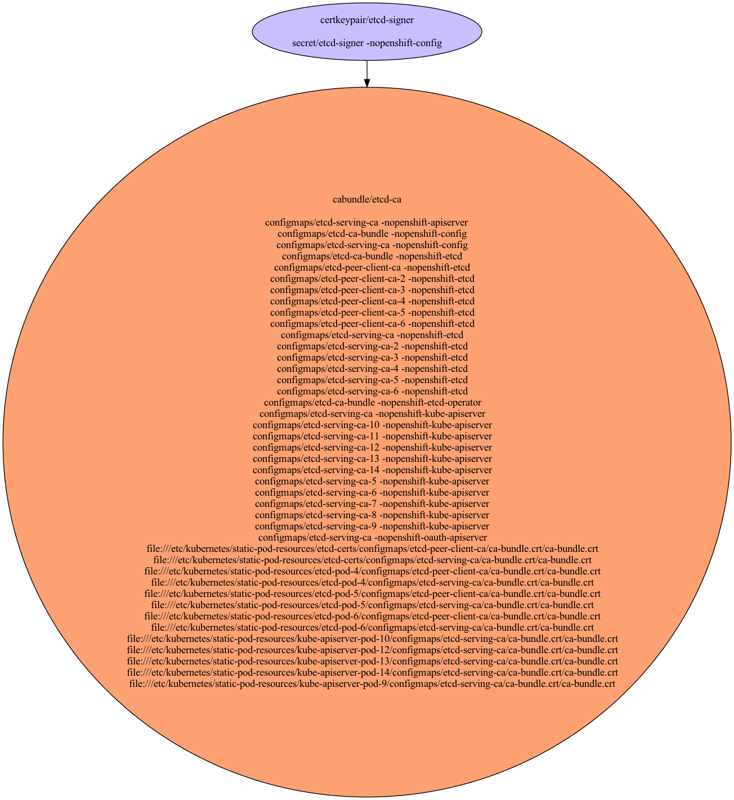

# etcd Certificates

Used to secure etcd internal communication and by apiservers to access etcd.

- [Signing Certificate/Key Pairs](#signing-certificatekey-pairs)
    - [etcd-signer](#etcd-signer)
- [Serving Certificate/Key Pairs](#serving-certificatekey-pairs)
    - [system:etcd-peer:etcd-client](#systemetcd-peeretcd-client)
    - [system:etcd-peer:etcd-client](#systemetcd-peeretcd-client)
    - [system:etcd-peer:etcd-client](#systemetcd-peeretcd-client)
    - [system:etcd-server:etcd-client](#systemetcd-serveretcd-client)
    - [system:etcd-server:etcd-client](#systemetcd-serveretcd-client)
    - [system:etcd-server:etcd-client](#systemetcd-serveretcd-client)
- [Client Certificate/Key Pairs](#client-certificatekey-pairs)
    - [etcd](#etcd)
    - [system:etcd-peer:etcd-client](#systemetcd-peeretcd-client)
    - [system:etcd-peer:etcd-client](#systemetcd-peeretcd-client)
    - [system:etcd-peer:etcd-client](#systemetcd-peeretcd-client)
    - [system:etcd-server:etcd-client](#systemetcd-serveretcd-client)
    - [system:etcd-server:etcd-client](#systemetcd-serveretcd-client)
    - [system:etcd-server:etcd-client](#systemetcd-serveretcd-client)
- [Certificates Without Keys](#certificates-without-keys)
- [Certificate Authority Bundles](#certificate-authority-bundles)
    - [etcd-ca](#etcd-ca)

## Signing Certificate/Key Pairs

### etcd-signer

Signer for etcd to create client and serving certificates.

| Property | Value |
| ----------- | ----------- |
| Type | Signer |
| CommonName | etcd-signer |
| SerialNumber | 5150005387928405585 |
| Issuer CommonName | [etcd-signer](#etcd-signer) |
| Validity | 10y |
| Signature Algorithm | SHA256-RSA |
| PublicKey Algorithm | RSA 2048 bit |
| Usages | - KeyUsageDigitalSignature - KeyUsageKeyEncipherment - KeyUsageCertSign |
| ExtendedUsages |  |

#### etcd-signer Locations
| Namespace | Secret Name |
| ----------- | ----------- |
| openshift-config | etcd-signer |

| File | Permissions | User | Group | SE Linux |
| ----------- | ----------- | ----------- | ----------- | ----------- |

## Serving Certificate/Key Pairs

### system:etcd-peer:etcd-client

| Property | Value |
| ----------- | ----------- |
| Type | Serving,Client |
| CommonName | system:etcd-peer:etcd-client |
| SerialNumber | 8953043022604429717 |
| Issuer CommonName | [etcd-signer](#etcd-signer) |
| Validity | 3y |
| Signature Algorithm | SHA256-RSA |
| PublicKey Algorithm | RSA 2048 bit |
| Usages | - KeyUsageDigitalSignature - KeyUsageKeyEncipherment |
| ExtendedUsages | - ExtKeyUsageClientAuth - ExtKeyUsageServerAuth |
| Organizations (User Groups) | - system:etcd-peers |
| DNS Names | - localhost - 10.0.0.4 |
| IP Addresses | - 10.0.0.4 |

#### system:etcd-peer:etcd-client Locations
| Namespace | Secret Name |
| ----------- | ----------- |
| openshift-etcd | etcd-peer-ci-ln-z2l4snt-f76d1-prqp5-master-0 |

| File | Permissions | User | Group | SE Linux |
| ----------- | ----------- | ----------- | ----------- | ----------- |
| /etc/kubernetes/static-pod-resources/etcd-certs/secrets/etcd-all-peer/etcd-peer-ci-ln-z2l4snt-f76d1-prqp5-master-0.crt/etcd-peer-ci-ln-z2l4snt-f76d1-prqp5-master-0.crt | -rw-------. | root | root | system_u:object_r:kubernetes_file_t:s0 |
| /etc/kubernetes/static-pod-resources/etcd-certs/secrets/etcd-all-peer/etcd-peer-ci-ln-z2l4snt-f76d1-prqp5-master-0.crt/etcd-peer-ci-ln-z2l4snt-f76d1-prqp5-master-0.key | -rw-------. | root | root | system_u:object_r:kubernetes_file_t:s0 |
| /etc/kubernetes/static-pod-resources/etcd-pod-2/secrets/etcd-all-peer/etcd-peer-ci-ln-z2l4snt-f76d1-prqp5-master-0.crt/etcd-peer-ci-ln-z2l4snt-f76d1-prqp5-master-0.crt | -rw-------. | root | root | system_u:object_r:kubernetes_file_t:s0 |
| /etc/kubernetes/static-pod-resources/etcd-pod-2/secrets/etcd-all-peer/etcd-peer-ci-ln-z2l4snt-f76d1-prqp5-master-0.crt/etcd-peer-ci-ln-z2l4snt-f76d1-prqp5-master-0.key | -rw-------. | root | root | system_u:object_r:kubernetes_file_t:s0 |
| /etc/kubernetes/static-pod-resources/etcd-pod-3/secrets/etcd-all-peer/etcd-peer-ci-ln-z2l4snt-f76d1-prqp5-master-0.crt/etcd-peer-ci-ln-z2l4snt-f76d1-prqp5-master-0.crt | -rw-------. | root | root | system_u:object_r:kubernetes_file_t:s0 |
| /etc/kubernetes/static-pod-resources/etcd-pod-3/secrets/etcd-all-peer/etcd-peer-ci-ln-z2l4snt-f76d1-prqp5-master-0.crt/etcd-peer-ci-ln-z2l4snt-f76d1-prqp5-master-0.key | -rw-------. | root | root | system_u:object_r:kubernetes_file_t:s0 |

### system:etcd-peer:etcd-client

| Property | Value |
| ----------- | ----------- |
| Type | Serving,Client |
| CommonName | system:etcd-peer:etcd-client |
| SerialNumber | 4885834619064510976 |
| Issuer CommonName | [etcd-signer](#etcd-signer) |
| Validity | 3y |
| Signature Algorithm | SHA256-RSA |
| PublicKey Algorithm | RSA 2048 bit |
| Usages | - KeyUsageDigitalSignature - KeyUsageKeyEncipherment |
| ExtendedUsages | - ExtKeyUsageClientAuth - ExtKeyUsageServerAuth |
| Organizations (User Groups) | - system:etcd-peers |
| DNS Names | - localhost - 10.0.0.3 |
| IP Addresses | - 10.0.0.3 |

#### system:etcd-peer:etcd-client Locations
| Namespace | Secret Name |
| ----------- | ----------- |
| openshift-etcd | etcd-peer-ci-ln-z2l4snt-f76d1-prqp5-master-1 |

| File | Permissions | User | Group | SE Linux |
| ----------- | ----------- | ----------- | ----------- | ----------- |
| /etc/kubernetes/static-pod-resources/etcd-certs/secrets/etcd-all-peer/etcd-peer-ci-ln-z2l4snt-f76d1-prqp5-master-1.crt/etcd-peer-ci-ln-z2l4snt-f76d1-prqp5-master-1.crt | -rw-------. | root | root | system_u:object_r:kubernetes_file_t:s0 |
| /etc/kubernetes/static-pod-resources/etcd-certs/secrets/etcd-all-peer/etcd-peer-ci-ln-z2l4snt-f76d1-prqp5-master-1.crt/etcd-peer-ci-ln-z2l4snt-f76d1-prqp5-master-1.key | -rw-------. | root | root | system_u:object_r:kubernetes_file_t:s0 |
| /etc/kubernetes/static-pod-resources/etcd-pod-2/secrets/etcd-all-peer/etcd-peer-ci-ln-z2l4snt-f76d1-prqp5-master-1.crt/etcd-peer-ci-ln-z2l4snt-f76d1-prqp5-master-1.crt | -rw-------. | root | root | system_u:object_r:kubernetes_file_t:s0 |
| /etc/kubernetes/static-pod-resources/etcd-pod-2/secrets/etcd-all-peer/etcd-peer-ci-ln-z2l4snt-f76d1-prqp5-master-1.crt/etcd-peer-ci-ln-z2l4snt-f76d1-prqp5-master-1.key | -rw-------. | root | root | system_u:object_r:kubernetes_file_t:s0 |
| /etc/kubernetes/static-pod-resources/etcd-pod-3/secrets/etcd-all-peer/etcd-peer-ci-ln-z2l4snt-f76d1-prqp5-master-1.crt/etcd-peer-ci-ln-z2l4snt-f76d1-prqp5-master-1.crt | -rw-------. | root | root | system_u:object_r:kubernetes_file_t:s0 |
| /etc/kubernetes/static-pod-resources/etcd-pod-3/secrets/etcd-all-peer/etcd-peer-ci-ln-z2l4snt-f76d1-prqp5-master-1.crt/etcd-peer-ci-ln-z2l4snt-f76d1-prqp5-master-1.key | -rw-------. | root | root | system_u:object_r:kubernetes_file_t:s0 |

### system:etcd-peer:etcd-client

| Property | Value |
| ----------- | ----------- |
| Type | Serving,Client |
| CommonName | system:etcd-peer:etcd-client |
| SerialNumber | 1580301937651503313 |
| Issuer CommonName | [etcd-signer](#etcd-signer) |
| Validity | 3y |
| Signature Algorithm | SHA256-RSA |
| PublicKey Algorithm | RSA 2048 bit |
| Usages | - KeyUsageDigitalSignature - KeyUsageKeyEncipherment |
| ExtendedUsages | - ExtKeyUsageClientAuth - ExtKeyUsageServerAuth |
| Organizations (User Groups) | - system:etcd-peers |
| DNS Names | - localhost - 10.0.0.5 |
| IP Addresses | - 10.0.0.5 |

#### system:etcd-peer:etcd-client Locations
| Namespace | Secret Name |
| ----------- | ----------- |
| openshift-etcd | etcd-peer-ci-ln-z2l4snt-f76d1-prqp5-master-2 |

| File | Permissions | User | Group | SE Linux |
| ----------- | ----------- | ----------- | ----------- | ----------- |
| /etc/kubernetes/static-pod-resources/etcd-certs/secrets/etcd-all-peer/etcd-peer-ci-ln-z2l4snt-f76d1-prqp5-master-2.crt/etcd-peer-ci-ln-z2l4snt-f76d1-prqp5-master-2.crt | -rw-------. | root | root | system_u:object_r:kubernetes_file_t:s0 |
| /etc/kubernetes/static-pod-resources/etcd-certs/secrets/etcd-all-peer/etcd-peer-ci-ln-z2l4snt-f76d1-prqp5-master-2.crt/etcd-peer-ci-ln-z2l4snt-f76d1-prqp5-master-2.key | -rw-------. | root | root | system_u:object_r:kubernetes_file_t:s0 |
| /etc/kubernetes/static-pod-resources/etcd-pod-2/secrets/etcd-all-peer/etcd-peer-ci-ln-z2l4snt-f76d1-prqp5-master-2.crt/etcd-peer-ci-ln-z2l4snt-f76d1-prqp5-master-2.crt | -rw-------. | root | root | system_u:object_r:kubernetes_file_t:s0 |
| /etc/kubernetes/static-pod-resources/etcd-pod-2/secrets/etcd-all-peer/etcd-peer-ci-ln-z2l4snt-f76d1-prqp5-master-2.crt/etcd-peer-ci-ln-z2l4snt-f76d1-prqp5-master-2.key | -rw-------. | root | root | system_u:object_r:kubernetes_file_t:s0 |
| /etc/kubernetes/static-pod-resources/etcd-pod-3/secrets/etcd-all-peer/etcd-peer-ci-ln-z2l4snt-f76d1-prqp5-master-2.crt/etcd-peer-ci-ln-z2l4snt-f76d1-prqp5-master-2.crt | -rw-------. | root | root | system_u:object_r:kubernetes_file_t:s0 |
| /etc/kubernetes/static-pod-resources/etcd-pod-3/secrets/etcd-all-peer/etcd-peer-ci-ln-z2l4snt-f76d1-prqp5-master-2.crt/etcd-peer-ci-ln-z2l4snt-f76d1-prqp5-master-2.key | -rw-------. | root | root | system_u:object_r:kubernetes_file_t:s0 |

### system:etcd-server:etcd-client

| Property | Value |
| ----------- | ----------- |
| Type | Serving,Client |
| CommonName | system:etcd-server:etcd-client |
| SerialNumber | 4042752185256536799 |
| Issuer CommonName | [etcd-signer](#etcd-signer) |
| Validity | 3y |
| Signature Algorithm | SHA256-RSA |
| PublicKey Algorithm | RSA 2048 bit |
| Usages | - KeyUsageDigitalSignature - KeyUsageKeyEncipherment |
| ExtendedUsages | - ExtKeyUsageClientAuth - ExtKeyUsageServerAuth |
| Organizations (User Groups) | - system:etcd-servers |
| DNS Names | - etcd.kube-system.svc - etcd.kube-system.svc.cluster.local - etcd.openshift-etcd.svc - etcd.openshift-etcd.svc.cluster.local - localhost - ::1 - 10.0.0.5 - 127.0.0.1 - ::1 |
| IP Addresses | - ::1 - 10.0.0.5 - 127.0.0.1 - ::1 |

#### system:etcd-server:etcd-client Locations
| Namespace | Secret Name |
| ----------- | ----------- |
| openshift-etcd | etcd-serving-ci-ln-z2l4snt-f76d1-prqp5-master-2 |

| File | Permissions | User | Group | SE Linux |
| ----------- | ----------- | ----------- | ----------- | ----------- |
| /etc/kubernetes/static-pod-resources/etcd-certs/secrets/etcd-all-serving/etcd-serving-ci-ln-z2l4snt-f76d1-prqp5-master-2.crt/etcd-serving-ci-ln-z2l4snt-f76d1-prqp5-master-2.crt | -rw-------. | root | root | system_u:object_r:kubernetes_file_t:s0 |
| /etc/kubernetes/static-pod-resources/etcd-certs/secrets/etcd-all-serving/etcd-serving-ci-ln-z2l4snt-f76d1-prqp5-master-2.crt/etcd-serving-ci-ln-z2l4snt-f76d1-prqp5-master-2.key | -rw-------. | root | root | system_u:object_r:kubernetes_file_t:s0 |
| /etc/kubernetes/static-pod-resources/etcd-pod-2/secrets/etcd-all-serving/etcd-serving-ci-ln-z2l4snt-f76d1-prqp5-master-2.crt/etcd-serving-ci-ln-z2l4snt-f76d1-prqp5-master-2.crt | -rw-------. | root | root | system_u:object_r:kubernetes_file_t:s0 |
| /etc/kubernetes/static-pod-resources/etcd-pod-2/secrets/etcd-all-serving/etcd-serving-ci-ln-z2l4snt-f76d1-prqp5-master-2.crt/etcd-serving-ci-ln-z2l4snt-f76d1-prqp5-master-2.key | -rw-------. | root | root | system_u:object_r:kubernetes_file_t:s0 |
| /etc/kubernetes/static-pod-resources/etcd-pod-3/secrets/etcd-all-serving/etcd-serving-ci-ln-z2l4snt-f76d1-prqp5-master-2.crt/etcd-serving-ci-ln-z2l4snt-f76d1-prqp5-master-2.crt | -rw-------. | root | root | system_u:object_r:kubernetes_file_t:s0 |
| /etc/kubernetes/static-pod-resources/etcd-pod-3/secrets/etcd-all-serving/etcd-serving-ci-ln-z2l4snt-f76d1-prqp5-master-2.crt/etcd-serving-ci-ln-z2l4snt-f76d1-prqp5-master-2.key | -rw-------. | root | root | system_u:object_r:kubernetes_file_t:s0 |

### system:etcd-server:etcd-client

| Property | Value |
| ----------- | ----------- |
| Type | Serving,Client |
| CommonName | system:etcd-server:etcd-client |
| SerialNumber | 91037334659722482 |
| Issuer CommonName | [etcd-signer](#etcd-signer) |
| Validity | 3y |
| Signature Algorithm | SHA256-RSA |
| PublicKey Algorithm | RSA 2048 bit |
| Usages | - KeyUsageDigitalSignature - KeyUsageKeyEncipherment |
| ExtendedUsages | - ExtKeyUsageClientAuth - ExtKeyUsageServerAuth |
| Organizations (User Groups) | - system:etcd-servers |
| DNS Names | - etcd.kube-system.svc - etcd.kube-system.svc.cluster.local - etcd.openshift-etcd.svc - etcd.openshift-etcd.svc.cluster.local - localhost - ::1 - 10.0.0.4 - 127.0.0.1 - ::1 |
| IP Addresses | - ::1 - 10.0.0.4 - 127.0.0.1 - ::1 |

#### system:etcd-server:etcd-client Locations
| Namespace | Secret Name |
| ----------- | ----------- |
| openshift-etcd | etcd-serving-ci-ln-z2l4snt-f76d1-prqp5-master-0 |

| File | Permissions | User | Group | SE Linux |
| ----------- | ----------- | ----------- | ----------- | ----------- |
| /etc/kubernetes/static-pod-resources/etcd-certs/secrets/etcd-all-serving/etcd-serving-ci-ln-z2l4snt-f76d1-prqp5-master-0.crt/etcd-serving-ci-ln-z2l4snt-f76d1-prqp5-master-0.crt | -rw-------. | root | root | system_u:object_r:kubernetes_file_t:s0 |
| /etc/kubernetes/static-pod-resources/etcd-certs/secrets/etcd-all-serving/etcd-serving-ci-ln-z2l4snt-f76d1-prqp5-master-0.crt/etcd-serving-ci-ln-z2l4snt-f76d1-prqp5-master-0.key | -rw-------. | root | root | system_u:object_r:kubernetes_file_t:s0 |
| /etc/kubernetes/static-pod-resources/etcd-pod-2/secrets/etcd-all-serving/etcd-serving-ci-ln-z2l4snt-f76d1-prqp5-master-0.crt/etcd-serving-ci-ln-z2l4snt-f76d1-prqp5-master-0.crt | -rw-------. | root | root | system_u:object_r:kubernetes_file_t:s0 |
| /etc/kubernetes/static-pod-resources/etcd-pod-2/secrets/etcd-all-serving/etcd-serving-ci-ln-z2l4snt-f76d1-prqp5-master-0.crt/etcd-serving-ci-ln-z2l4snt-f76d1-prqp5-master-0.key | -rw-------. | root | root | system_u:object_r:kubernetes_file_t:s0 |
| /etc/kubernetes/static-pod-resources/etcd-pod-3/secrets/etcd-all-serving/etcd-serving-ci-ln-z2l4snt-f76d1-prqp5-master-0.crt/etcd-serving-ci-ln-z2l4snt-f76d1-prqp5-master-0.crt | -rw-------. | root | root | system_u:object_r:kubernetes_file_t:s0 |
| /etc/kubernetes/static-pod-resources/etcd-pod-3/secrets/etcd-all-serving/etcd-serving-ci-ln-z2l4snt-f76d1-prqp5-master-0.crt/etcd-serving-ci-ln-z2l4snt-f76d1-prqp5-master-0.key | -rw-------. | root | root | system_u:object_r:kubernetes_file_t:s0 |

### system:etcd-server:etcd-client

| Property | Value |
| ----------- | ----------- |
| Type | Serving,Client |
| CommonName | system:etcd-server:etcd-client |
| SerialNumber | 9191087523657495108 |
| Issuer CommonName | [etcd-signer](#etcd-signer) |
| Validity | 3y |
| Signature Algorithm | SHA256-RSA |
| PublicKey Algorithm | RSA 2048 bit |
| Usages | - KeyUsageDigitalSignature - KeyUsageKeyEncipherment |
| ExtendedUsages | - ExtKeyUsageClientAuth - ExtKeyUsageServerAuth |
| Organizations (User Groups) | - system:etcd-servers |
| DNS Names | - etcd.kube-system.svc - etcd.kube-system.svc.cluster.local - etcd.openshift-etcd.svc - etcd.openshift-etcd.svc.cluster.local - localhost - ::1 - 10.0.0.3 - 127.0.0.1 - ::1 |
| IP Addresses | - ::1 - 10.0.0.3 - 127.0.0.1 - ::1 |

#### system:etcd-server:etcd-client Locations
| Namespace | Secret Name |
| ----------- | ----------- |
| openshift-etcd | etcd-serving-ci-ln-z2l4snt-f76d1-prqp5-master-1 |

| File | Permissions | User | Group | SE Linux |
| ----------- | ----------- | ----------- | ----------- | ----------- |
| /etc/kubernetes/static-pod-resources/etcd-certs/secrets/etcd-all-serving/etcd-serving-ci-ln-z2l4snt-f76d1-prqp5-master-1.crt/etcd-serving-ci-ln-z2l4snt-f76d1-prqp5-master-1.crt | -rw-------. | root | root | system_u:object_r:kubernetes_file_t:s0 |
| /etc/kubernetes/static-pod-resources/etcd-certs/secrets/etcd-all-serving/etcd-serving-ci-ln-z2l4snt-f76d1-prqp5-master-1.crt/etcd-serving-ci-ln-z2l4snt-f76d1-prqp5-master-1.key | -rw-------. | root | root | system_u:object_r:kubernetes_file_t:s0 |
| /etc/kubernetes/static-pod-resources/etcd-pod-2/secrets/etcd-all-serving/etcd-serving-ci-ln-z2l4snt-f76d1-prqp5-master-1.crt/etcd-serving-ci-ln-z2l4snt-f76d1-prqp5-master-1.crt | -rw-------. | root | root | system_u:object_r:kubernetes_file_t:s0 |
| /etc/kubernetes/static-pod-resources/etcd-pod-2/secrets/etcd-all-serving/etcd-serving-ci-ln-z2l4snt-f76d1-prqp5-master-1.crt/etcd-serving-ci-ln-z2l4snt-f76d1-prqp5-master-1.key | -rw-------. | root | root | system_u:object_r:kubernetes_file_t:s0 |
| /etc/kubernetes/static-pod-resources/etcd-pod-3/secrets/etcd-all-serving/etcd-serving-ci-ln-z2l4snt-f76d1-prqp5-master-1.crt/etcd-serving-ci-ln-z2l4snt-f76d1-prqp5-master-1.crt | -rw-------. | root | root | system_u:object_r:kubernetes_file_t:s0 |
| /etc/kubernetes/static-pod-resources/etcd-pod-3/secrets/etcd-all-serving/etcd-serving-ci-ln-z2l4snt-f76d1-prqp5-master-1.crt/etcd-serving-ci-ln-z2l4snt-f76d1-prqp5-master-1.key | -rw-------. | root | root | system_u:object_r:kubernetes_file_t:s0 |

## Client Certificate/Key Pairs

### etcd

| Property | Value |
| ----------- | ----------- |
| Type | Client |
| CommonName | etcd |
| SerialNumber | 7239217573520392488 |
| Issuer CommonName | [etcd-signer](#etcd-signer) |
| Validity | 10y |
| Signature Algorithm | SHA256-RSA |
| PublicKey Algorithm | RSA 2048 bit |
| Usages | - KeyUsageKeyEncipherment |
| ExtendedUsages | - ExtKeyUsageClientAuth |
| Organizations (User Groups) |  |

#### etcd Locations
| Namespace | Secret Name |
| ----------- | ----------- |
| openshift-apiserver | etcd-client |
| openshift-config | etcd-client |
| openshift-etcd | etcd-client |
| openshift-etcd-operator | etcd-client |
| openshift-kube-apiserver | etcd-client |
| openshift-kube-apiserver | etcd-client-2 |
| openshift-kube-apiserver | etcd-client-3 |
| openshift-kube-apiserver | etcd-client-4 |
| openshift-oauth-apiserver | etcd-client |

| File | Permissions | User | Group | SE Linux |
| ----------- | ----------- | ----------- | ----------- | ----------- |
| /etc/kubernetes/static-pod-resources/kube-apiserver-pod-2/secrets/etcd-client/tls.crt/tls.crt | -rw-------. | root | root | system_u:object_r:kubernetes_file_t:s0 |
| /etc/kubernetes/static-pod-resources/kube-apiserver-pod-2/secrets/etcd-client/tls.crt/tls.key | -rw-------. | root | root | system_u:object_r:kubernetes_file_t:s0 |
| /etc/kubernetes/static-pod-resources/kube-apiserver-pod-3/secrets/etcd-client/tls.crt/tls.crt | -rw-------. | root | root | system_u:object_r:kubernetes_file_t:s0 |
| /etc/kubernetes/static-pod-resources/kube-apiserver-pod-3/secrets/etcd-client/tls.crt/tls.key | -rw-------. | root | root | system_u:object_r:kubernetes_file_t:s0 |
| /etc/kubernetes/static-pod-resources/kube-apiserver-pod-4/secrets/etcd-client/tls.crt/tls.crt | -rw-------. | root | root | system_u:object_r:kubernetes_file_t:s0 |
| /etc/kubernetes/static-pod-resources/kube-apiserver-pod-4/secrets/etcd-client/tls.crt/tls.key | -rw-------. | root | root | system_u:object_r:kubernetes_file_t:s0 |

### system:etcd-peer:etcd-client

| Property | Value |
| ----------- | ----------- |
| Type | Serving,Client |
| CommonName | system:etcd-peer:etcd-client |
| SerialNumber | 8953043022604429717 |
| Issuer CommonName | [etcd-signer](#etcd-signer) |
| Validity | 3y |
| Signature Algorithm | SHA256-RSA |
| PublicKey Algorithm | RSA 2048 bit |
| Usages | - KeyUsageDigitalSignature - KeyUsageKeyEncipherment |
| ExtendedUsages | - ExtKeyUsageClientAuth - ExtKeyUsageServerAuth |
| Organizations (User Groups) | - system:etcd-peers |
| DNS Names | - localhost - 10.0.0.4 |
| IP Addresses | - 10.0.0.4 |

#### system:etcd-peer:etcd-client Locations
| Namespace | Secret Name |
| ----------- | ----------- |
| openshift-etcd | etcd-peer-ci-ln-z2l4snt-f76d1-prqp5-master-0 |

| File | Permissions | User | Group | SE Linux |
| ----------- | ----------- | ----------- | ----------- | ----------- |
| /etc/kubernetes/static-pod-resources/etcd-certs/secrets/etcd-all-peer/etcd-peer-ci-ln-z2l4snt-f76d1-prqp5-master-0.crt/etcd-peer-ci-ln-z2l4snt-f76d1-prqp5-master-0.crt | -rw-------. | root | root | system_u:object_r:kubernetes_file_t:s0 |
| /etc/kubernetes/static-pod-resources/etcd-certs/secrets/etcd-all-peer/etcd-peer-ci-ln-z2l4snt-f76d1-prqp5-master-0.crt/etcd-peer-ci-ln-z2l4snt-f76d1-prqp5-master-0.key | -rw-------. | root | root | system_u:object_r:kubernetes_file_t:s0 |
| /etc/kubernetes/static-pod-resources/etcd-pod-2/secrets/etcd-all-peer/etcd-peer-ci-ln-z2l4snt-f76d1-prqp5-master-0.crt/etcd-peer-ci-ln-z2l4snt-f76d1-prqp5-master-0.crt | -rw-------. | root | root | system_u:object_r:kubernetes_file_t:s0 |
| /etc/kubernetes/static-pod-resources/etcd-pod-2/secrets/etcd-all-peer/etcd-peer-ci-ln-z2l4snt-f76d1-prqp5-master-0.crt/etcd-peer-ci-ln-z2l4snt-f76d1-prqp5-master-0.key | -rw-------. | root | root | system_u:object_r:kubernetes_file_t:s0 |
| /etc/kubernetes/static-pod-resources/etcd-pod-3/secrets/etcd-all-peer/etcd-peer-ci-ln-z2l4snt-f76d1-prqp5-master-0.crt/etcd-peer-ci-ln-z2l4snt-f76d1-prqp5-master-0.crt | -rw-------. | root | root | system_u:object_r:kubernetes_file_t:s0 |
| /etc/kubernetes/static-pod-resources/etcd-pod-3/secrets/etcd-all-peer/etcd-peer-ci-ln-z2l4snt-f76d1-prqp5-master-0.crt/etcd-peer-ci-ln-z2l4snt-f76d1-prqp5-master-0.key | -rw-------. | root | root | system_u:object_r:kubernetes_file_t:s0 |

### system:etcd-peer:etcd-client

| Property | Value |
| ----------- | ----------- |
| Type | Serving,Client |
| CommonName | system:etcd-peer:etcd-client |
| SerialNumber | 4885834619064510976 |
| Issuer CommonName | [etcd-signer](#etcd-signer) |
| Validity | 3y |
| Signature Algorithm | SHA256-RSA |
| PublicKey Algorithm | RSA 2048 bit |
| Usages | - KeyUsageDigitalSignature - KeyUsageKeyEncipherment |
| ExtendedUsages | - ExtKeyUsageClientAuth - ExtKeyUsageServerAuth |
| Organizations (User Groups) | - system:etcd-peers |
| DNS Names | - localhost - 10.0.0.3 |
| IP Addresses | - 10.0.0.3 |

#### system:etcd-peer:etcd-client Locations
| Namespace | Secret Name |
| ----------- | ----------- |
| openshift-etcd | etcd-peer-ci-ln-z2l4snt-f76d1-prqp5-master-1 |

| File | Permissions | User | Group | SE Linux |
| ----------- | ----------- | ----------- | ----------- | ----------- |
| /etc/kubernetes/static-pod-resources/etcd-certs/secrets/etcd-all-peer/etcd-peer-ci-ln-z2l4snt-f76d1-prqp5-master-1.crt/etcd-peer-ci-ln-z2l4snt-f76d1-prqp5-master-1.crt | -rw-------. | root | root | system_u:object_r:kubernetes_file_t:s0 |
| /etc/kubernetes/static-pod-resources/etcd-certs/secrets/etcd-all-peer/etcd-peer-ci-ln-z2l4snt-f76d1-prqp5-master-1.crt/etcd-peer-ci-ln-z2l4snt-f76d1-prqp5-master-1.key | -rw-------. | root | root | system_u:object_r:kubernetes_file_t:s0 |
| /etc/kubernetes/static-pod-resources/etcd-pod-2/secrets/etcd-all-peer/etcd-peer-ci-ln-z2l4snt-f76d1-prqp5-master-1.crt/etcd-peer-ci-ln-z2l4snt-f76d1-prqp5-master-1.crt | -rw-------. | root | root | system_u:object_r:kubernetes_file_t:s0 |
| /etc/kubernetes/static-pod-resources/etcd-pod-2/secrets/etcd-all-peer/etcd-peer-ci-ln-z2l4snt-f76d1-prqp5-master-1.crt/etcd-peer-ci-ln-z2l4snt-f76d1-prqp5-master-1.key | -rw-------. | root | root | system_u:object_r:kubernetes_file_t:s0 |
| /etc/kubernetes/static-pod-resources/etcd-pod-3/secrets/etcd-all-peer/etcd-peer-ci-ln-z2l4snt-f76d1-prqp5-master-1.crt/etcd-peer-ci-ln-z2l4snt-f76d1-prqp5-master-1.crt | -rw-------. | root | root | system_u:object_r:kubernetes_file_t:s0 |
| /etc/kubernetes/static-pod-resources/etcd-pod-3/secrets/etcd-all-peer/etcd-peer-ci-ln-z2l4snt-f76d1-prqp5-master-1.crt/etcd-peer-ci-ln-z2l4snt-f76d1-prqp5-master-1.key | -rw-------. | root | root | system_u:object_r:kubernetes_file_t:s0 |

### system:etcd-peer:etcd-client

| Property | Value |
| ----------- | ----------- |
| Type | Serving,Client |
| CommonName | system:etcd-peer:etcd-client |
| SerialNumber | 1580301937651503313 |
| Issuer CommonName | [etcd-signer](#etcd-signer) |
| Validity | 3y |
| Signature Algorithm | SHA256-RSA |
| PublicKey Algorithm | RSA 2048 bit |
| Usages | - KeyUsageDigitalSignature - KeyUsageKeyEncipherment |
| ExtendedUsages | - ExtKeyUsageClientAuth - ExtKeyUsageServerAuth |
| Organizations (User Groups) | - system:etcd-peers |
| DNS Names | - localhost - 10.0.0.5 |
| IP Addresses | - 10.0.0.5 |

#### system:etcd-peer:etcd-client Locations
| Namespace | Secret Name |
| ----------- | ----------- |
| openshift-etcd | etcd-peer-ci-ln-z2l4snt-f76d1-prqp5-master-2 |

| File | Permissions | User | Group | SE Linux |
| ----------- | ----------- | ----------- | ----------- | ----------- |
| /etc/kubernetes/static-pod-resources/etcd-certs/secrets/etcd-all-peer/etcd-peer-ci-ln-z2l4snt-f76d1-prqp5-master-2.crt/etcd-peer-ci-ln-z2l4snt-f76d1-prqp5-master-2.crt | -rw-------. | root | root | system_u:object_r:kubernetes_file_t:s0 |
| /etc/kubernetes/static-pod-resources/etcd-certs/secrets/etcd-all-peer/etcd-peer-ci-ln-z2l4snt-f76d1-prqp5-master-2.crt/etcd-peer-ci-ln-z2l4snt-f76d1-prqp5-master-2.key | -rw-------. | root | root | system_u:object_r:kubernetes_file_t:s0 |
| /etc/kubernetes/static-pod-resources/etcd-pod-2/secrets/etcd-all-peer/etcd-peer-ci-ln-z2l4snt-f76d1-prqp5-master-2.crt/etcd-peer-ci-ln-z2l4snt-f76d1-prqp5-master-2.crt | -rw-------. | root | root | system_u:object_r:kubernetes_file_t:s0 |
| /etc/kubernetes/static-pod-resources/etcd-pod-2/secrets/etcd-all-peer/etcd-peer-ci-ln-z2l4snt-f76d1-prqp5-master-2.crt/etcd-peer-ci-ln-z2l4snt-f76d1-prqp5-master-2.key | -rw-------. | root | root | system_u:object_r:kubernetes_file_t:s0 |
| /etc/kubernetes/static-pod-resources/etcd-pod-3/secrets/etcd-all-peer/etcd-peer-ci-ln-z2l4snt-f76d1-prqp5-master-2.crt/etcd-peer-ci-ln-z2l4snt-f76d1-prqp5-master-2.crt | -rw-------. | root | root | system_u:object_r:kubernetes_file_t:s0 |
| /etc/kubernetes/static-pod-resources/etcd-pod-3/secrets/etcd-all-peer/etcd-peer-ci-ln-z2l4snt-f76d1-prqp5-master-2.crt/etcd-peer-ci-ln-z2l4snt-f76d1-prqp5-master-2.key | -rw-------. | root | root | system_u:object_r:kubernetes_file_t:s0 |

### system:etcd-server:etcd-client

| Property | Value |
| ----------- | ----------- |
| Type | Serving,Client |
| CommonName | system:etcd-server:etcd-client |
| SerialNumber | 4042752185256536799 |
| Issuer CommonName | [etcd-signer](#etcd-signer) |
| Validity | 3y |
| Signature Algorithm | SHA256-RSA |
| PublicKey Algorithm | RSA 2048 bit |
| Usages | - KeyUsageDigitalSignature - KeyUsageKeyEncipherment |
| ExtendedUsages | - ExtKeyUsageClientAuth - ExtKeyUsageServerAuth |
| Organizations (User Groups) | - system:etcd-servers |
| DNS Names | - etcd.kube-system.svc - etcd.kube-system.svc.cluster.local - etcd.openshift-etcd.svc - etcd.openshift-etcd.svc.cluster.local - localhost - ::1 - 10.0.0.5 - 127.0.0.1 - ::1 |
| IP Addresses | - ::1 - 10.0.0.5 - 127.0.0.1 - ::1 |

#### system:etcd-server:etcd-client Locations
| Namespace | Secret Name |
| ----------- | ----------- |
| openshift-etcd | etcd-serving-ci-ln-z2l4snt-f76d1-prqp5-master-2 |

| File | Permissions | User | Group | SE Linux |
| ----------- | ----------- | ----------- | ----------- | ----------- |
| /etc/kubernetes/static-pod-resources/etcd-certs/secrets/etcd-all-serving/etcd-serving-ci-ln-z2l4snt-f76d1-prqp5-master-2.crt/etcd-serving-ci-ln-z2l4snt-f76d1-prqp5-master-2.crt | -rw-------. | root | root | system_u:object_r:kubernetes_file_t:s0 |
| /etc/kubernetes/static-pod-resources/etcd-certs/secrets/etcd-all-serving/etcd-serving-ci-ln-z2l4snt-f76d1-prqp5-master-2.crt/etcd-serving-ci-ln-z2l4snt-f76d1-prqp5-master-2.key | -rw-------. | root | root | system_u:object_r:kubernetes_file_t:s0 |
| /etc/kubernetes/static-pod-resources/etcd-pod-2/secrets/etcd-all-serving/etcd-serving-ci-ln-z2l4snt-f76d1-prqp5-master-2.crt/etcd-serving-ci-ln-z2l4snt-f76d1-prqp5-master-2.crt | -rw-------. | root | root | system_u:object_r:kubernetes_file_t:s0 |
| /etc/kubernetes/static-pod-resources/etcd-pod-2/secrets/etcd-all-serving/etcd-serving-ci-ln-z2l4snt-f76d1-prqp5-master-2.crt/etcd-serving-ci-ln-z2l4snt-f76d1-prqp5-master-2.key | -rw-------. | root | root | system_u:object_r:kubernetes_file_t:s0 |
| /etc/kubernetes/static-pod-resources/etcd-pod-3/secrets/etcd-all-serving/etcd-serving-ci-ln-z2l4snt-f76d1-prqp5-master-2.crt/etcd-serving-ci-ln-z2l4snt-f76d1-prqp5-master-2.crt | -rw-------. | root | root | system_u:object_r:kubernetes_file_t:s0 |
| /etc/kubernetes/static-pod-resources/etcd-pod-3/secrets/etcd-all-serving/etcd-serving-ci-ln-z2l4snt-f76d1-prqp5-master-2.crt/etcd-serving-ci-ln-z2l4snt-f76d1-prqp5-master-2.key | -rw-------. | root | root | system_u:object_r:kubernetes_file_t:s0 |

### system:etcd-server:etcd-client

| Property | Value |
| ----------- | ----------- |
| Type | Serving,Client |
| CommonName | system:etcd-server:etcd-client |
| SerialNumber | 91037334659722482 |
| Issuer CommonName | [etcd-signer](#etcd-signer) |
| Validity | 3y |
| Signature Algorithm | SHA256-RSA |
| PublicKey Algorithm | RSA 2048 bit |
| Usages | - KeyUsageDigitalSignature - KeyUsageKeyEncipherment |
| ExtendedUsages | - ExtKeyUsageClientAuth - ExtKeyUsageServerAuth |
| Organizations (User Groups) | - system:etcd-servers |
| DNS Names | - etcd.kube-system.svc - etcd.kube-system.svc.cluster.local - etcd.openshift-etcd.svc - etcd.openshift-etcd.svc.cluster.local - localhost - ::1 - 10.0.0.4 - 127.0.0.1 - ::1 |
| IP Addresses | - ::1 - 10.0.0.4 - 127.0.0.1 - ::1 |

#### system:etcd-server:etcd-client Locations
| Namespace | Secret Name |
| ----------- | ----------- |
| openshift-etcd | etcd-serving-ci-ln-z2l4snt-f76d1-prqp5-master-0 |

| File | Permissions | User | Group | SE Linux |
| ----------- | ----------- | ----------- | ----------- | ----------- |
| /etc/kubernetes/static-pod-resources/etcd-certs/secrets/etcd-all-serving/etcd-serving-ci-ln-z2l4snt-f76d1-prqp5-master-0.crt/etcd-serving-ci-ln-z2l4snt-f76d1-prqp5-master-0.crt | -rw-------. | root | root | system_u:object_r:kubernetes_file_t:s0 |
| /etc/kubernetes/static-pod-resources/etcd-certs/secrets/etcd-all-serving/etcd-serving-ci-ln-z2l4snt-f76d1-prqp5-master-0.crt/etcd-serving-ci-ln-z2l4snt-f76d1-prqp5-master-0.key | -rw-------. | root | root | system_u:object_r:kubernetes_file_t:s0 |
| /etc/kubernetes/static-pod-resources/etcd-pod-2/secrets/etcd-all-serving/etcd-serving-ci-ln-z2l4snt-f76d1-prqp5-master-0.crt/etcd-serving-ci-ln-z2l4snt-f76d1-prqp5-master-0.crt | -rw-------. | root | root | system_u:object_r:kubernetes_file_t:s0 |
| /etc/kubernetes/static-pod-resources/etcd-pod-2/secrets/etcd-all-serving/etcd-serving-ci-ln-z2l4snt-f76d1-prqp5-master-0.crt/etcd-serving-ci-ln-z2l4snt-f76d1-prqp5-master-0.key | -rw-------. | root | root | system_u:object_r:kubernetes_file_t:s0 |
| /etc/kubernetes/static-pod-resources/etcd-pod-3/secrets/etcd-all-serving/etcd-serving-ci-ln-z2l4snt-f76d1-prqp5-master-0.crt/etcd-serving-ci-ln-z2l4snt-f76d1-prqp5-master-0.crt | -rw-------. | root | root | system_u:object_r:kubernetes_file_t:s0 |
| /etc/kubernetes/static-pod-resources/etcd-pod-3/secrets/etcd-all-serving/etcd-serving-ci-ln-z2l4snt-f76d1-prqp5-master-0.crt/etcd-serving-ci-ln-z2l4snt-f76d1-prqp5-master-0.key | -rw-------. | root | root | system_u:object_r:kubernetes_file_t:s0 |

### system:etcd-server:etcd-client

| Property | Value |
| ----------- | ----------- |
| Type | Serving,Client |
| CommonName | system:etcd-server:etcd-client |
| SerialNumber | 9191087523657495108 |
| Issuer CommonName | [etcd-signer](#etcd-signer) |
| Validity | 3y |
| Signature Algorithm | SHA256-RSA |
| PublicKey Algorithm | RSA 2048 bit |
| Usages | - KeyUsageDigitalSignature - KeyUsageKeyEncipherment |
| ExtendedUsages | - ExtKeyUsageClientAuth - ExtKeyUsageServerAuth |
| Organizations (User Groups) | - system:etcd-servers |
| DNS Names | - etcd.kube-system.svc - etcd.kube-system.svc.cluster.local - etcd.openshift-etcd.svc - etcd.openshift-etcd.svc.cluster.local - localhost - ::1 - 10.0.0.3 - 127.0.0.1 - ::1 |
| IP Addresses | - ::1 - 10.0.0.3 - 127.0.0.1 - ::1 |

#### system:etcd-server:etcd-client Locations
| Namespace | Secret Name |
| ----------- | ----------- |
| openshift-etcd | etcd-serving-ci-ln-z2l4snt-f76d1-prqp5-master-1 |

| File | Permissions | User | Group | SE Linux |
| ----------- | ----------- | ----------- | ----------- | ----------- |
| /etc/kubernetes/static-pod-resources/etcd-certs/secrets/etcd-all-serving/etcd-serving-ci-ln-z2l4snt-f76d1-prqp5-master-1.crt/etcd-serving-ci-ln-z2l4snt-f76d1-prqp5-master-1.crt | -rw-------. | root | root | system_u:object_r:kubernetes_file_t:s0 |
| /etc/kubernetes/static-pod-resources/etcd-certs/secrets/etcd-all-serving/etcd-serving-ci-ln-z2l4snt-f76d1-prqp5-master-1.crt/etcd-serving-ci-ln-z2l4snt-f76d1-prqp5-master-1.key | -rw-------. | root | root | system_u:object_r:kubernetes_file_t:s0 |
| /etc/kubernetes/static-pod-resources/etcd-pod-2/secrets/etcd-all-serving/etcd-serving-ci-ln-z2l4snt-f76d1-prqp5-master-1.crt/etcd-serving-ci-ln-z2l4snt-f76d1-prqp5-master-1.crt | -rw-------. | root | root | system_u:object_r:kubernetes_file_t:s0 |
| /etc/kubernetes/static-pod-resources/etcd-pod-2/secrets/etcd-all-serving/etcd-serving-ci-ln-z2l4snt-f76d1-prqp5-master-1.crt/etcd-serving-ci-ln-z2l4snt-f76d1-prqp5-master-1.key | -rw-------. | root | root | system_u:object_r:kubernetes_file_t:s0 |
| /etc/kubernetes/static-pod-resources/etcd-pod-3/secrets/etcd-all-serving/etcd-serving-ci-ln-z2l4snt-f76d1-prqp5-master-1.crt/etcd-serving-ci-ln-z2l4snt-f76d1-prqp5-master-1.crt | -rw-------. | root | root | system_u:object_r:kubernetes_file_t:s0 |
| /etc/kubernetes/static-pod-resources/etcd-pod-3/secrets/etcd-all-serving/etcd-serving-ci-ln-z2l4snt-f76d1-prqp5-master-1.crt/etcd-serving-ci-ln-z2l4snt-f76d1-prqp5-master-1.key | -rw-------. | root | root | system_u:object_r:kubernetes_file_t:s0 |

## Certificates Without Keys

These certificates are present in certificate authority bundles, but do not have keys in the cluster.
This happens when the installer bootstrap clusters with a set of certificate/key pairs that are deleted during the
installation process.

## Certificate Authority Bundles

### etcd-ca

CA for recognizing etcd serving, peer, and client certificates.

**Bundled Certificates**

| CommonName | Issuer CommonName | Validity | PublicKey Algorithm |
| ----------- | ----------- | ----------- | ----------- |
| [etcd-signer](#etcd-signer) | [etcd-signer](#etcd-signer) | 10y | RSA 2048 bit |

#### etcd-ca Locations
| Namespace | ConfigMap Name |
| ----------- | ----------- |
| openshift-apiserver | etcd-serving-ca |
| openshift-config | etcd-ca-bundle |
| openshift-config | etcd-serving-ca |
| openshift-etcd | etcd-ca-bundle |
| openshift-etcd | etcd-peer-client-ca |
| openshift-etcd | etcd-peer-client-ca-2 |
| openshift-etcd | etcd-peer-client-ca-3 |
| openshift-etcd | etcd-serving-ca |
| openshift-etcd | etcd-serving-ca-2 |
| openshift-etcd | etcd-serving-ca-3 |
| openshift-etcd-operator | etcd-ca-bundle |
| openshift-kube-apiserver | etcd-serving-ca |
| openshift-kube-apiserver | etcd-serving-ca-2 |
| openshift-kube-apiserver | etcd-serving-ca-3 |
| openshift-kube-apiserver | etcd-serving-ca-4 |
| openshift-oauth-apiserver | etcd-serving-ca |

| File | Permissions | User | Group | SE Linux |
| ----------- | ----------- | ----------- | ----------- | ----------- |
| /etc/kubernetes/static-pod-resources/etcd-certs/configmaps/etcd-peer-client-ca/ca-bundle.crt/ca-bundle.crt | -rw-r--r--. | root | root | system_u:object_r:kubernetes_file_t:s0 |
| /etc/kubernetes/static-pod-resources/etcd-certs/configmaps/etcd-serving-ca/ca-bundle.crt/ca-bundle.crt | -rw-r--r--. | root | root | system_u:object_r:kubernetes_file_t:s0 |
| /etc/kubernetes/static-pod-resources/etcd-pod-2/configmaps/etcd-peer-client-ca/ca-bundle.crt/ca-bundle.crt | -rw-r--r--. | root | root | system_u:object_r:kubernetes_file_t:s0 |
| /etc/kubernetes/static-pod-resources/etcd-pod-2/configmaps/etcd-serving-ca/ca-bundle.crt/ca-bundle.crt | -rw-r--r--. | root | root | system_u:object_r:kubernetes_file_t:s0 |
| /etc/kubernetes/static-pod-resources/etcd-pod-3/configmaps/etcd-peer-client-ca/ca-bundle.crt/ca-bundle.crt | -rw-r--r--. | root | root | system_u:object_r:kubernetes_file_t:s0 |
| /etc/kubernetes/static-pod-resources/etcd-pod-3/configmaps/etcd-serving-ca/ca-bundle.crt/ca-bundle.crt | -rw-r--r--. | root | root | system_u:object_r:kubernetes_file_t:s0 |
| /etc/kubernetes/static-pod-resources/kube-apiserver-pod-2/configmaps/etcd-serving-ca/ca-bundle.crt/ca-bundle.crt | -rw-r--r--. | root | root | system_u:object_r:kubernetes_file_t:s0 |
| /etc/kubernetes/static-pod-resources/kube-apiserver-pod-3/configmaps/etcd-serving-ca/ca-bundle.crt/ca-bundle.crt | -rw-r--r--. | root | root | system_u:object_r:kubernetes_file_t:s0 |
| /etc/kubernetes/static-pod-resources/kube-apiserver-pod-4/configmaps/etcd-serving-ca/ca-bundle.crt/ca-bundle.crt | -rw-r--r--. | root | root | system_u:object_r:kubernetes_file_t:s0 |

