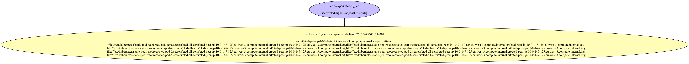
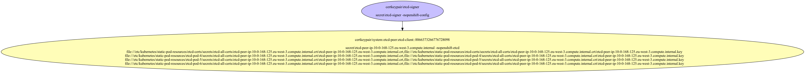
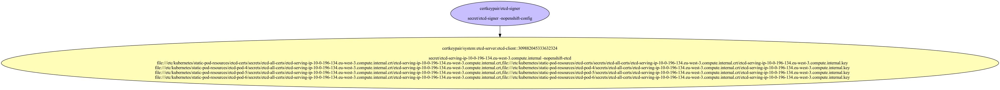
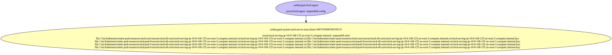
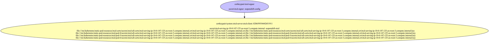
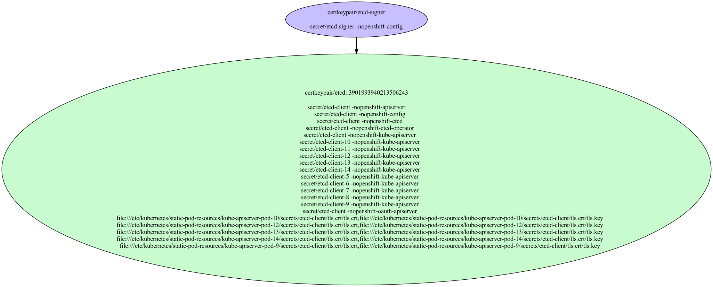

# etcd Certificates

Used to secure etcd internal communication and by apiservers to access etcd.

- [Signing Certificate/Key Pairs](#signing-certificatekey-pairs)
    - [etcd-signer](#etcd-signer)
- [Serving Certificate/Key Pairs](#serving-certificatekey-pairs)
    - [system:etcd-peer:etcd-client](#systemetcd-peeretcd-client)
    - [system:etcd-peer:etcd-client](#systemetcd-peeretcd-client)
    - [system:etcd-peer:etcd-client](#systemetcd-peeretcd-client)
    - [system:etcd-server:etcd-client](#systemetcd-serveretcd-client)
    - [system:etcd-server:etcd-client](#systemetcd-serveretcd-client)
    - [system:etcd-server:etcd-client](#systemetcd-serveretcd-client)
- [Client Certificate/Key Pairs](#client-certificatekey-pairs)
    - [etcd](#etcd)
    - [system:etcd-peer:etcd-client](#systemetcd-peeretcd-client)
    - [system:etcd-peer:etcd-client](#systemetcd-peeretcd-client)
    - [system:etcd-peer:etcd-client](#systemetcd-peeretcd-client)
    - [system:etcd-server:etcd-client](#systemetcd-serveretcd-client)
    - [system:etcd-server:etcd-client](#systemetcd-serveretcd-client)
    - [system:etcd-server:etcd-client](#systemetcd-serveretcd-client)
- [Certificates Without Keys](#certificates-without-keys)
- [Certificate Authority Bundles](#certificate-authority-bundles)
    - [etcd-ca](#etcd-ca)

## Signing Certificate/Key Pairs

### etcd-signer

Signer for etcd to create client and serving certificates.

| Property | Value |
| ----------- | ----------- |
| Type | Signer |
| CommonName | etcd-signer |
| SerialNumber | 3095213136292102545 |
| Issuer CommonName | [etcd-signer](#etcd-signer) |
| Validity | 10y |
| Signature Algorithm | SHA256-RSA |
| PublicKey Algorithm | RSA 2048 bit |
| Usages | - KeyUsageDigitalSignature - KeyUsageKeyEncipherment - KeyUsageCertSign |
| ExtendedUsages |  |

#### etcd-signer Locations
| Namespace | Secret Name |
| ----------- | ----------- |
| openshift-config | etcd-signer |

| File | Permissions | User | Group | SE Linux |
| ----------- | ----------- | ----------- | ----------- | ----------- |

## Serving Certificate/Key Pairs

### system:etcd-peer:etcd-client

| Property | Value |
| ----------- | ----------- |
| Type | Serving,Client |
| CommonName | system:etcd-peer:etcd-client |
| SerialNumber | 285525283827702177 |
| Issuer CommonName | [etcd-signer](#etcd-signer) |
| Validity | 3y |
| Signature Algorithm | SHA256-RSA |
| PublicKey Algorithm | RSA 2048 bit |
| Usages | - KeyUsageDigitalSignature - KeyUsageKeyEncipherment |
| ExtendedUsages | - ExtKeyUsageClientAuth - ExtKeyUsageServerAuth |
| Organizations (User Groups) | - system:etcd-peers |
| DNS Names | - localhost - 10.0.196.134 |
| IP Addresses | - 10.0.196.134 |

#### system:etcd-peer:etcd-client Locations
| Namespace | Secret Name |
| ----------- | ----------- |
| openshift-etcd | etcd-peer-ip-10-0-196-134.eu-west-3.compute.internal |

| File | Permissions | User | Group | SE Linux |
| ----------- | ----------- | ----------- | ----------- | ----------- |
| /etc/kubernetes/static-pod-resources/etcd-certs/secrets/etcd-all-certs/etcd-peer-ip-10-0-196-134.eu-west-3.compute.internal.crt/etcd-peer-ip-10-0-196-134.eu-west-3.compute.internal.crt | -rw-------. | root | root | system_u:object_r:kubernetes_file_t:s0 |
| /etc/kubernetes/static-pod-resources/etcd-certs/secrets/etcd-all-certs/etcd-peer-ip-10-0-196-134.eu-west-3.compute.internal.crt/etcd-peer-ip-10-0-196-134.eu-west-3.compute.internal.key | -rw-------. | root | root | system_u:object_r:kubernetes_file_t:s0 |
| /etc/kubernetes/static-pod-resources/etcd-pod-4/secrets/etcd-all-certs/etcd-peer-ip-10-0-196-134.eu-west-3.compute.internal.crt/etcd-peer-ip-10-0-196-134.eu-west-3.compute.internal.crt | -rw-------. | root | root | system_u:object_r:kubernetes_file_t:s0 |
| /etc/kubernetes/static-pod-resources/etcd-pod-4/secrets/etcd-all-certs/etcd-peer-ip-10-0-196-134.eu-west-3.compute.internal.crt/etcd-peer-ip-10-0-196-134.eu-west-3.compute.internal.key | -rw-------. | root | root | system_u:object_r:kubernetes_file_t:s0 |
| /etc/kubernetes/static-pod-resources/etcd-pod-5/secrets/etcd-all-certs/etcd-peer-ip-10-0-196-134.eu-west-3.compute.internal.crt/etcd-peer-ip-10-0-196-134.eu-west-3.compute.internal.crt | -rw-------. | root | root | system_u:object_r:kubernetes_file_t:s0 |
| /etc/kubernetes/static-pod-resources/etcd-pod-5/secrets/etcd-all-certs/etcd-peer-ip-10-0-196-134.eu-west-3.compute.internal.crt/etcd-peer-ip-10-0-196-134.eu-west-3.compute.internal.key | -rw-------. | root | root | system_u:object_r:kubernetes_file_t:s0 |
| /etc/kubernetes/static-pod-resources/etcd-pod-6/secrets/etcd-all-certs/etcd-peer-ip-10-0-196-134.eu-west-3.compute.internal.crt/etcd-peer-ip-10-0-196-134.eu-west-3.compute.internal.crt | -rw-------. | root | root | system_u:object_r:kubernetes_file_t:s0 |
| /etc/kubernetes/static-pod-resources/etcd-pod-6/secrets/etcd-all-certs/etcd-peer-ip-10-0-196-134.eu-west-3.compute.internal.crt/etcd-peer-ip-10-0-196-134.eu-west-3.compute.internal.key | -rw-------. | root | root | system_u:object_r:kubernetes_file_t:s0 |

### system:etcd-peer:etcd-client

| Property | Value |
| ----------- | ----------- |
| Type | Serving,Client |
| CommonName | system:etcd-peer:etcd-client |
| SerialNumber | 261706756071794302 |
| Issuer CommonName | [etcd-signer](#etcd-signer) |
| Validity | 3y |
| Signature Algorithm | SHA256-RSA |
| PublicKey Algorithm | RSA 2048 bit |
| Usages | - KeyUsageDigitalSignature - KeyUsageKeyEncipherment |
| ExtendedUsages | - ExtKeyUsageClientAuth - ExtKeyUsageServerAuth |
| Organizations (User Groups) | - system:etcd-peers |
| DNS Names | - localhost - 10.0.147.125 |
| IP Addresses | - 10.0.147.125 |

#### system:etcd-peer:etcd-client Locations
| Namespace | Secret Name |
| ----------- | ----------- |
| openshift-etcd | etcd-peer-ip-10-0-147-125.eu-west-3.compute.internal |

| File | Permissions | User | Group | SE Linux |
| ----------- | ----------- | ----------- | ----------- | ----------- |
| /etc/kubernetes/static-pod-resources/etcd-certs/secrets/etcd-all-certs/etcd-peer-ip-10-0-147-125.eu-west-3.compute.internal.crt/etcd-peer-ip-10-0-147-125.eu-west-3.compute.internal.crt | -rw-------. | root | root | system_u:object_r:kubernetes_file_t:s0 |
| /etc/kubernetes/static-pod-resources/etcd-certs/secrets/etcd-all-certs/etcd-peer-ip-10-0-147-125.eu-west-3.compute.internal.crt/etcd-peer-ip-10-0-147-125.eu-west-3.compute.internal.key | -rw-------. | root | root | system_u:object_r:kubernetes_file_t:s0 |
| /etc/kubernetes/static-pod-resources/etcd-pod-4/secrets/etcd-all-certs/etcd-peer-ip-10-0-147-125.eu-west-3.compute.internal.crt/etcd-peer-ip-10-0-147-125.eu-west-3.compute.internal.crt | -rw-------. | root | root | system_u:object_r:kubernetes_file_t:s0 |
| /etc/kubernetes/static-pod-resources/etcd-pod-4/secrets/etcd-all-certs/etcd-peer-ip-10-0-147-125.eu-west-3.compute.internal.crt/etcd-peer-ip-10-0-147-125.eu-west-3.compute.internal.key | -rw-------. | root | root | system_u:object_r:kubernetes_file_t:s0 |
| /etc/kubernetes/static-pod-resources/etcd-pod-5/secrets/etcd-all-certs/etcd-peer-ip-10-0-147-125.eu-west-3.compute.internal.crt/etcd-peer-ip-10-0-147-125.eu-west-3.compute.internal.crt | -rw-------. | root | root | system_u:object_r:kubernetes_file_t:s0 |
| /etc/kubernetes/static-pod-resources/etcd-pod-5/secrets/etcd-all-certs/etcd-peer-ip-10-0-147-125.eu-west-3.compute.internal.crt/etcd-peer-ip-10-0-147-125.eu-west-3.compute.internal.key | -rw-------. | root | root | system_u:object_r:kubernetes_file_t:s0 |
| /etc/kubernetes/static-pod-resources/etcd-pod-6/secrets/etcd-all-certs/etcd-peer-ip-10-0-147-125.eu-west-3.compute.internal.crt/etcd-peer-ip-10-0-147-125.eu-west-3.compute.internal.crt | -rw-------. | root | root | system_u:object_r:kubernetes_file_t:s0 |
| /etc/kubernetes/static-pod-resources/etcd-pod-6/secrets/etcd-all-certs/etcd-peer-ip-10-0-147-125.eu-west-3.compute.internal.crt/etcd-peer-ip-10-0-147-125.eu-west-3.compute.internal.key | -rw-------. | root | root | system_u:object_r:kubernetes_file_t:s0 |

### system:etcd-peer:etcd-client

| Property | Value |
| ----------- | ----------- |
| Type | Serving,Client |
| CommonName | system:etcd-peer:etcd-client |
| SerialNumber | 8866373266776728098 |
| Issuer CommonName | [etcd-signer](#etcd-signer) |
| Validity | 3y |
| Signature Algorithm | SHA256-RSA |
| PublicKey Algorithm | RSA 2048 bit |
| Usages | - KeyUsageDigitalSignature - KeyUsageKeyEncipherment |
| ExtendedUsages | - ExtKeyUsageClientAuth - ExtKeyUsageServerAuth |
| Organizations (User Groups) | - system:etcd-peers |
| DNS Names | - localhost - 10.0.168.125 |
| IP Addresses | - 10.0.168.125 |

#### system:etcd-peer:etcd-client Locations
| Namespace | Secret Name |
| ----------- | ----------- |
| openshift-etcd | etcd-peer-ip-10-0-168-125.eu-west-3.compute.internal |

| File | Permissions | User | Group | SE Linux |
| ----------- | ----------- | ----------- | ----------- | ----------- |
| /etc/kubernetes/static-pod-resources/etcd-certs/secrets/etcd-all-certs/etcd-peer-ip-10-0-168-125.eu-west-3.compute.internal.crt/etcd-peer-ip-10-0-168-125.eu-west-3.compute.internal.crt | -rw-------. | root | root | system_u:object_r:kubernetes_file_t:s0 |
| /etc/kubernetes/static-pod-resources/etcd-certs/secrets/etcd-all-certs/etcd-peer-ip-10-0-168-125.eu-west-3.compute.internal.crt/etcd-peer-ip-10-0-168-125.eu-west-3.compute.internal.key | -rw-------. | root | root | system_u:object_r:kubernetes_file_t:s0 |
| /etc/kubernetes/static-pod-resources/etcd-pod-4/secrets/etcd-all-certs/etcd-peer-ip-10-0-168-125.eu-west-3.compute.internal.crt/etcd-peer-ip-10-0-168-125.eu-west-3.compute.internal.crt | -rw-------. | root | root | system_u:object_r:kubernetes_file_t:s0 |
| /etc/kubernetes/static-pod-resources/etcd-pod-4/secrets/etcd-all-certs/etcd-peer-ip-10-0-168-125.eu-west-3.compute.internal.crt/etcd-peer-ip-10-0-168-125.eu-west-3.compute.internal.key | -rw-------. | root | root | system_u:object_r:kubernetes_file_t:s0 |
| /etc/kubernetes/static-pod-resources/etcd-pod-5/secrets/etcd-all-certs/etcd-peer-ip-10-0-168-125.eu-west-3.compute.internal.crt/etcd-peer-ip-10-0-168-125.eu-west-3.compute.internal.crt | -rw-------. | root | root | system_u:object_r:kubernetes_file_t:s0 |
| /etc/kubernetes/static-pod-resources/etcd-pod-5/secrets/etcd-all-certs/etcd-peer-ip-10-0-168-125.eu-west-3.compute.internal.crt/etcd-peer-ip-10-0-168-125.eu-west-3.compute.internal.key | -rw-------. | root | root | system_u:object_r:kubernetes_file_t:s0 |
| /etc/kubernetes/static-pod-resources/etcd-pod-6/secrets/etcd-all-certs/etcd-peer-ip-10-0-168-125.eu-west-3.compute.internal.crt/etcd-peer-ip-10-0-168-125.eu-west-3.compute.internal.crt | -rw-------. | root | root | system_u:object_r:kubernetes_file_t:s0 |
| /etc/kubernetes/static-pod-resources/etcd-pod-6/secrets/etcd-all-certs/etcd-peer-ip-10-0-168-125.eu-west-3.compute.internal.crt/etcd-peer-ip-10-0-168-125.eu-west-3.compute.internal.key | -rw-------. | root | root | system_u:object_r:kubernetes_file_t:s0 |

### system:etcd-server:etcd-client

| Property | Value |
| ----------- | ----------- |
| Type | Serving,Client |
| CommonName | system:etcd-server:etcd-client |
| SerialNumber | 309882045333632324 |
| Issuer CommonName | [etcd-signer](#etcd-signer) |
| Validity | 3y |
| Signature Algorithm | SHA256-RSA |
| PublicKey Algorithm | RSA 2048 bit |
| Usages | - KeyUsageDigitalSignature - KeyUsageKeyEncipherment |
| ExtendedUsages | - ExtKeyUsageClientAuth - ExtKeyUsageServerAuth |
| Organizations (User Groups) | - system:etcd-servers |
| DNS Names | - etcd.kube-system.svc - etcd.kube-system.svc.cluster.local - etcd.openshift-etcd.svc - etcd.openshift-etcd.svc.cluster.local - localhost - ::1 - 10.0.196.134 - 127.0.0.1 - ::1 |
| IP Addresses | - ::1 - 10.0.196.134 - 127.0.0.1 - ::1 |

#### system:etcd-server:etcd-client Locations
| Namespace | Secret Name |
| ----------- | ----------- |
| openshift-etcd | etcd-serving-ip-10-0-196-134.eu-west-3.compute.internal |

| File | Permissions | User | Group | SE Linux |
| ----------- | ----------- | ----------- | ----------- | ----------- |
| /etc/kubernetes/static-pod-resources/etcd-certs/secrets/etcd-all-certs/etcd-serving-ip-10-0-196-134.eu-west-3.compute.internal.crt/etcd-serving-ip-10-0-196-134.eu-west-3.compute.internal.crt | -rw-------. | root | root | system_u:object_r:kubernetes_file_t:s0 |
| /etc/kubernetes/static-pod-resources/etcd-certs/secrets/etcd-all-certs/etcd-serving-ip-10-0-196-134.eu-west-3.compute.internal.crt/etcd-serving-ip-10-0-196-134.eu-west-3.compute.internal.key | -rw-------. | root | root | system_u:object_r:kubernetes_file_t:s0 |
| /etc/kubernetes/static-pod-resources/etcd-pod-4/secrets/etcd-all-certs/etcd-serving-ip-10-0-196-134.eu-west-3.compute.internal.crt/etcd-serving-ip-10-0-196-134.eu-west-3.compute.internal.crt | -rw-------. | root | root | system_u:object_r:kubernetes_file_t:s0 |
| /etc/kubernetes/static-pod-resources/etcd-pod-4/secrets/etcd-all-certs/etcd-serving-ip-10-0-196-134.eu-west-3.compute.internal.crt/etcd-serving-ip-10-0-196-134.eu-west-3.compute.internal.key | -rw-------. | root | root | system_u:object_r:kubernetes_file_t:s0 |
| /etc/kubernetes/static-pod-resources/etcd-pod-5/secrets/etcd-all-certs/etcd-serving-ip-10-0-196-134.eu-west-3.compute.internal.crt/etcd-serving-ip-10-0-196-134.eu-west-3.compute.internal.crt | -rw-------. | root | root | system_u:object_r:kubernetes_file_t:s0 |
| /etc/kubernetes/static-pod-resources/etcd-pod-5/secrets/etcd-all-certs/etcd-serving-ip-10-0-196-134.eu-west-3.compute.internal.crt/etcd-serving-ip-10-0-196-134.eu-west-3.compute.internal.key | -rw-------. | root | root | system_u:object_r:kubernetes_file_t:s0 |
| /etc/kubernetes/static-pod-resources/etcd-pod-6/secrets/etcd-all-certs/etcd-serving-ip-10-0-196-134.eu-west-3.compute.internal.crt/etcd-serving-ip-10-0-196-134.eu-west-3.compute.internal.crt | -rw-------. | root | root | system_u:object_r:kubernetes_file_t:s0 |
| /etc/kubernetes/static-pod-resources/etcd-pod-6/secrets/etcd-all-certs/etcd-serving-ip-10-0-196-134.eu-west-3.compute.internal.crt/etcd-serving-ip-10-0-196-134.eu-west-3.compute.internal.key | -rw-------. | root | root | system_u:object_r:kubernetes_file_t:s0 |

### system:etcd-server:etcd-client

| Property | Value |
| ----------- | ----------- |
| Type | Serving,Client |
| CommonName | system:etcd-server:etcd-client |
| SerialNumber | 6907393098780758135 |
| Issuer CommonName | [etcd-signer](#etcd-signer) |
| Validity | 3y |
| Signature Algorithm | SHA256-RSA |
| PublicKey Algorithm | RSA 2048 bit |
| Usages | - KeyUsageDigitalSignature - KeyUsageKeyEncipherment |
| ExtendedUsages | - ExtKeyUsageClientAuth - ExtKeyUsageServerAuth |
| Organizations (User Groups) | - system:etcd-servers |
| DNS Names | - etcd.kube-system.svc - etcd.kube-system.svc.cluster.local - etcd.openshift-etcd.svc - etcd.openshift-etcd.svc.cluster.local - localhost - ::1 - 10.0.168.125 - 127.0.0.1 - ::1 |
| IP Addresses | - ::1 - 10.0.168.125 - 127.0.0.1 - ::1 |

#### system:etcd-server:etcd-client Locations
| Namespace | Secret Name |
| ----------- | ----------- |
| openshift-etcd | etcd-serving-ip-10-0-168-125.eu-west-3.compute.internal |

| File | Permissions | User | Group | SE Linux |
| ----------- | ----------- | ----------- | ----------- | ----------- |
| /etc/kubernetes/static-pod-resources/etcd-certs/secrets/etcd-all-certs/etcd-serving-ip-10-0-168-125.eu-west-3.compute.internal.crt/etcd-serving-ip-10-0-168-125.eu-west-3.compute.internal.crt | -rw-------. | root | root | system_u:object_r:kubernetes_file_t:s0 |
| /etc/kubernetes/static-pod-resources/etcd-certs/secrets/etcd-all-certs/etcd-serving-ip-10-0-168-125.eu-west-3.compute.internal.crt/etcd-serving-ip-10-0-168-125.eu-west-3.compute.internal.key | -rw-------. | root | root | system_u:object_r:kubernetes_file_t:s0 |
| /etc/kubernetes/static-pod-resources/etcd-pod-4/secrets/etcd-all-certs/etcd-serving-ip-10-0-168-125.eu-west-3.compute.internal.crt/etcd-serving-ip-10-0-168-125.eu-west-3.compute.internal.crt | -rw-------. | root | root | system_u:object_r:kubernetes_file_t:s0 |
| /etc/kubernetes/static-pod-resources/etcd-pod-4/secrets/etcd-all-certs/etcd-serving-ip-10-0-168-125.eu-west-3.compute.internal.crt/etcd-serving-ip-10-0-168-125.eu-west-3.compute.internal.key | -rw-------. | root | root | system_u:object_r:kubernetes_file_t:s0 |
| /etc/kubernetes/static-pod-resources/etcd-pod-5/secrets/etcd-all-certs/etcd-serving-ip-10-0-168-125.eu-west-3.compute.internal.crt/etcd-serving-ip-10-0-168-125.eu-west-3.compute.internal.crt | -rw-------. | root | root | system_u:object_r:kubernetes_file_t:s0 |
| /etc/kubernetes/static-pod-resources/etcd-pod-5/secrets/etcd-all-certs/etcd-serving-ip-10-0-168-125.eu-west-3.compute.internal.crt/etcd-serving-ip-10-0-168-125.eu-west-3.compute.internal.key | -rw-------. | root | root | system_u:object_r:kubernetes_file_t:s0 |
| /etc/kubernetes/static-pod-resources/etcd-pod-6/secrets/etcd-all-certs/etcd-serving-ip-10-0-168-125.eu-west-3.compute.internal.crt/etcd-serving-ip-10-0-168-125.eu-west-3.compute.internal.crt | -rw-------. | root | root | system_u:object_r:kubernetes_file_t:s0 |
| /etc/kubernetes/static-pod-resources/etcd-pod-6/secrets/etcd-all-certs/etcd-serving-ip-10-0-168-125.eu-west-3.compute.internal.crt/etcd-serving-ip-10-0-168-125.eu-west-3.compute.internal.key | -rw-------. | root | root | system_u:object_r:kubernetes_file_t:s0 |

### system:etcd-server:etcd-client

| Property | Value |
| ----------- | ----------- |
| Type | Serving,Client |
| CommonName | system:etcd-server:etcd-client |
| SerialNumber | 828659554442651911 |
| Issuer CommonName | [etcd-signer](#etcd-signer) |
| Validity | 3y |
| Signature Algorithm | SHA256-RSA |
| PublicKey Algorithm | RSA 2048 bit |
| Usages | - KeyUsageDigitalSignature - KeyUsageKeyEncipherment |
| ExtendedUsages | - ExtKeyUsageClientAuth - ExtKeyUsageServerAuth |
| Organizations (User Groups) | - system:etcd-servers |
| DNS Names | - etcd.kube-system.svc - etcd.kube-system.svc.cluster.local - etcd.openshift-etcd.svc - etcd.openshift-etcd.svc.cluster.local - localhost - ::1 - 10.0.147.125 - 127.0.0.1 - ::1 |
| IP Addresses | - ::1 - 10.0.147.125 - 127.0.0.1 - ::1 |

#### system:etcd-server:etcd-client Locations
| Namespace | Secret Name |
| ----------- | ----------- |
| openshift-etcd | etcd-serving-ip-10-0-147-125.eu-west-3.compute.internal |

| File | Permissions | User | Group | SE Linux |
| ----------- | ----------- | ----------- | ----------- | ----------- |
| /etc/kubernetes/static-pod-resources/etcd-certs/secrets/etcd-all-certs/etcd-serving-ip-10-0-147-125.eu-west-3.compute.internal.crt/etcd-serving-ip-10-0-147-125.eu-west-3.compute.internal.crt | -rw-------. | root | root | system_u:object_r:kubernetes_file_t:s0 |
| /etc/kubernetes/static-pod-resources/etcd-certs/secrets/etcd-all-certs/etcd-serving-ip-10-0-147-125.eu-west-3.compute.internal.crt/etcd-serving-ip-10-0-147-125.eu-west-3.compute.internal.key | -rw-------. | root | root | system_u:object_r:kubernetes_file_t:s0 |
| /etc/kubernetes/static-pod-resources/etcd-pod-4/secrets/etcd-all-certs/etcd-serving-ip-10-0-147-125.eu-west-3.compute.internal.crt/etcd-serving-ip-10-0-147-125.eu-west-3.compute.internal.crt | -rw-------. | root | root | system_u:object_r:kubernetes_file_t:s0 |
| /etc/kubernetes/static-pod-resources/etcd-pod-4/secrets/etcd-all-certs/etcd-serving-ip-10-0-147-125.eu-west-3.compute.internal.crt/etcd-serving-ip-10-0-147-125.eu-west-3.compute.internal.key | -rw-------. | root | root | system_u:object_r:kubernetes_file_t:s0 |
| /etc/kubernetes/static-pod-resources/etcd-pod-5/secrets/etcd-all-certs/etcd-serving-ip-10-0-147-125.eu-west-3.compute.internal.crt/etcd-serving-ip-10-0-147-125.eu-west-3.compute.internal.crt | -rw-------. | root | root | system_u:object_r:kubernetes_file_t:s0 |
| /etc/kubernetes/static-pod-resources/etcd-pod-5/secrets/etcd-all-certs/etcd-serving-ip-10-0-147-125.eu-west-3.compute.internal.crt/etcd-serving-ip-10-0-147-125.eu-west-3.compute.internal.key | -rw-------. | root | root | system_u:object_r:kubernetes_file_t:s0 |
| /etc/kubernetes/static-pod-resources/etcd-pod-6/secrets/etcd-all-certs/etcd-serving-ip-10-0-147-125.eu-west-3.compute.internal.crt/etcd-serving-ip-10-0-147-125.eu-west-3.compute.internal.crt | -rw-------. | root | root | system_u:object_r:kubernetes_file_t:s0 |
| /etc/kubernetes/static-pod-resources/etcd-pod-6/secrets/etcd-all-certs/etcd-serving-ip-10-0-147-125.eu-west-3.compute.internal.crt/etcd-serving-ip-10-0-147-125.eu-west-3.compute.internal.key | -rw-------. | root | root | system_u:object_r:kubernetes_file_t:s0 |

## Client Certificate/Key Pairs

### etcd

| Property | Value |
| ----------- | ----------- |
| Type | Client |
| CommonName | etcd |
| SerialNumber | 3901993940213506243 |
| Issuer CommonName | [etcd-signer](#etcd-signer) |
| Validity | 10y |
| Signature Algorithm | SHA256-RSA |
| PublicKey Algorithm | RSA 2048 bit |
| Usages | - KeyUsageDigitalSignature - KeyUsageKeyEncipherment |
| ExtendedUsages | - ExtKeyUsageClientAuth |
| Organizations (User Groups) | - etcd |

#### etcd Locations
| Namespace | Secret Name |
| ----------- | ----------- |
| openshift-apiserver | etcd-client |
| openshift-config | etcd-client |
| openshift-etcd | etcd-client |
| openshift-etcd-operator | etcd-client |
| openshift-kube-apiserver | etcd-client |
| openshift-kube-apiserver | etcd-client-10 |
| openshift-kube-apiserver | etcd-client-11 |
| openshift-kube-apiserver | etcd-client-12 |
| openshift-kube-apiserver | etcd-client-13 |
| openshift-kube-apiserver | etcd-client-14 |
| openshift-kube-apiserver | etcd-client-5 |
| openshift-kube-apiserver | etcd-client-6 |
| openshift-kube-apiserver | etcd-client-7 |
| openshift-kube-apiserver | etcd-client-8 |
| openshift-kube-apiserver | etcd-client-9 |
| openshift-oauth-apiserver | etcd-client |

| File | Permissions | User | Group | SE Linux |
| ----------- | ----------- | ----------- | ----------- | ----------- |
| /etc/kubernetes/static-pod-resources/kube-apiserver-pod-10/secrets/etcd-client/tls.crt/tls.crt | -rw-------. | root | root | system_u:object_r:kubernetes_file_t:s0 |
| /etc/kubernetes/static-pod-resources/kube-apiserver-pod-10/secrets/etcd-client/tls.crt/tls.key | -rw-------. | root | root | system_u:object_r:kubernetes_file_t:s0 |
| /etc/kubernetes/static-pod-resources/kube-apiserver-pod-12/secrets/etcd-client/tls.crt/tls.crt | -rw-------. | root | root | system_u:object_r:kubernetes_file_t:s0 |
| /etc/kubernetes/static-pod-resources/kube-apiserver-pod-12/secrets/etcd-client/tls.crt/tls.key | -rw-------. | root | root | system_u:object_r:kubernetes_file_t:s0 |
| /etc/kubernetes/static-pod-resources/kube-apiserver-pod-13/secrets/etcd-client/tls.crt/tls.crt | -rw-------. | root | root | system_u:object_r:kubernetes_file_t:s0 |
| /etc/kubernetes/static-pod-resources/kube-apiserver-pod-13/secrets/etcd-client/tls.crt/tls.key | -rw-------. | root | root | system_u:object_r:kubernetes_file_t:s0 |
| /etc/kubernetes/static-pod-resources/kube-apiserver-pod-14/secrets/etcd-client/tls.crt/tls.crt | -rw-------. | root | root | system_u:object_r:kubernetes_file_t:s0 |
| /etc/kubernetes/static-pod-resources/kube-apiserver-pod-14/secrets/etcd-client/tls.crt/tls.key | -rw-------. | root | root | system_u:object_r:kubernetes_file_t:s0 |
| /etc/kubernetes/static-pod-resources/kube-apiserver-pod-9/secrets/etcd-client/tls.crt/tls.crt | -rw-------. | root | root | system_u:object_r:kubernetes_file_t:s0 |
| /etc/kubernetes/static-pod-resources/kube-apiserver-pod-9/secrets/etcd-client/tls.crt/tls.key | -rw-------. | root | root | system_u:object_r:kubernetes_file_t:s0 |

### system:etcd-peer:etcd-client

| Property | Value |
| ----------- | ----------- |
| Type | Serving,Client |
| CommonName | system:etcd-peer:etcd-client |
| SerialNumber | 285525283827702177 |
| Issuer CommonName | [etcd-signer](#etcd-signer) |
| Validity | 3y |
| Signature Algorithm | SHA256-RSA |
| PublicKey Algorithm | RSA 2048 bit |
| Usages | - KeyUsageDigitalSignature - KeyUsageKeyEncipherment |
| ExtendedUsages | - ExtKeyUsageClientAuth - ExtKeyUsageServerAuth |
| Organizations (User Groups) | - system:etcd-peers |
| DNS Names | - localhost - 10.0.196.134 |
| IP Addresses | - 10.0.196.134 |

#### system:etcd-peer:etcd-client Locations
| Namespace | Secret Name |
| ----------- | ----------- |
| openshift-etcd | etcd-peer-ip-10-0-196-134.eu-west-3.compute.internal |

| File | Permissions | User | Group | SE Linux |
| ----------- | ----------- | ----------- | ----------- | ----------- |
| /etc/kubernetes/static-pod-resources/etcd-certs/secrets/etcd-all-certs/etcd-peer-ip-10-0-196-134.eu-west-3.compute.internal.crt/etcd-peer-ip-10-0-196-134.eu-west-3.compute.internal.crt | -rw-------. | root | root | system_u:object_r:kubernetes_file_t:s0 |
| /etc/kubernetes/static-pod-resources/etcd-certs/secrets/etcd-all-certs/etcd-peer-ip-10-0-196-134.eu-west-3.compute.internal.crt/etcd-peer-ip-10-0-196-134.eu-west-3.compute.internal.key | -rw-------. | root | root | system_u:object_r:kubernetes_file_t:s0 |
| /etc/kubernetes/static-pod-resources/etcd-pod-4/secrets/etcd-all-certs/etcd-peer-ip-10-0-196-134.eu-west-3.compute.internal.crt/etcd-peer-ip-10-0-196-134.eu-west-3.compute.internal.crt | -rw-------. | root | root | system_u:object_r:kubernetes_file_t:s0 |
| /etc/kubernetes/static-pod-resources/etcd-pod-4/secrets/etcd-all-certs/etcd-peer-ip-10-0-196-134.eu-west-3.compute.internal.crt/etcd-peer-ip-10-0-196-134.eu-west-3.compute.internal.key | -rw-------. | root | root | system_u:object_r:kubernetes_file_t:s0 |
| /etc/kubernetes/static-pod-resources/etcd-pod-5/secrets/etcd-all-certs/etcd-peer-ip-10-0-196-134.eu-west-3.compute.internal.crt/etcd-peer-ip-10-0-196-134.eu-west-3.compute.internal.crt | -rw-------. | root | root | system_u:object_r:kubernetes_file_t:s0 |
| /etc/kubernetes/static-pod-resources/etcd-pod-5/secrets/etcd-all-certs/etcd-peer-ip-10-0-196-134.eu-west-3.compute.internal.crt/etcd-peer-ip-10-0-196-134.eu-west-3.compute.internal.key | -rw-------. | root | root | system_u:object_r:kubernetes_file_t:s0 |
| /etc/kubernetes/static-pod-resources/etcd-pod-6/secrets/etcd-all-certs/etcd-peer-ip-10-0-196-134.eu-west-3.compute.internal.crt/etcd-peer-ip-10-0-196-134.eu-west-3.compute.internal.crt | -rw-------. | root | root | system_u:object_r:kubernetes_file_t:s0 |
| /etc/kubernetes/static-pod-resources/etcd-pod-6/secrets/etcd-all-certs/etcd-peer-ip-10-0-196-134.eu-west-3.compute.internal.crt/etcd-peer-ip-10-0-196-134.eu-west-3.compute.internal.key | -rw-------. | root | root | system_u:object_r:kubernetes_file_t:s0 |

### system:etcd-peer:etcd-client

| Property | Value |
| ----------- | ----------- |
| Type | Serving,Client |
| CommonName | system:etcd-peer:etcd-client |
| SerialNumber | 261706756071794302 |
| Issuer CommonName | [etcd-signer](#etcd-signer) |
| Validity | 3y |
| Signature Algorithm | SHA256-RSA |
| PublicKey Algorithm | RSA 2048 bit |
| Usages | - KeyUsageDigitalSignature - KeyUsageKeyEncipherment |
| ExtendedUsages | - ExtKeyUsageClientAuth - ExtKeyUsageServerAuth |
| Organizations (User Groups) | - system:etcd-peers |
| DNS Names | - localhost - 10.0.147.125 |
| IP Addresses | - 10.0.147.125 |

#### system:etcd-peer:etcd-client Locations
| Namespace | Secret Name |
| ----------- | ----------- |
| openshift-etcd | etcd-peer-ip-10-0-147-125.eu-west-3.compute.internal |

| File | Permissions | User | Group | SE Linux |
| ----------- | ----------- | ----------- | ----------- | ----------- |
| /etc/kubernetes/static-pod-resources/etcd-certs/secrets/etcd-all-certs/etcd-peer-ip-10-0-147-125.eu-west-3.compute.internal.crt/etcd-peer-ip-10-0-147-125.eu-west-3.compute.internal.crt | -rw-------. | root | root | system_u:object_r:kubernetes_file_t:s0 |
| /etc/kubernetes/static-pod-resources/etcd-certs/secrets/etcd-all-certs/etcd-peer-ip-10-0-147-125.eu-west-3.compute.internal.crt/etcd-peer-ip-10-0-147-125.eu-west-3.compute.internal.key | -rw-------. | root | root | system_u:object_r:kubernetes_file_t:s0 |
| /etc/kubernetes/static-pod-resources/etcd-pod-4/secrets/etcd-all-certs/etcd-peer-ip-10-0-147-125.eu-west-3.compute.internal.crt/etcd-peer-ip-10-0-147-125.eu-west-3.compute.internal.crt | -rw-------. | root | root | system_u:object_r:kubernetes_file_t:s0 |
| /etc/kubernetes/static-pod-resources/etcd-pod-4/secrets/etcd-all-certs/etcd-peer-ip-10-0-147-125.eu-west-3.compute.internal.crt/etcd-peer-ip-10-0-147-125.eu-west-3.compute.internal.key | -rw-------. | root | root | system_u:object_r:kubernetes_file_t:s0 |
| /etc/kubernetes/static-pod-resources/etcd-pod-5/secrets/etcd-all-certs/etcd-peer-ip-10-0-147-125.eu-west-3.compute.internal.crt/etcd-peer-ip-10-0-147-125.eu-west-3.compute.internal.crt | -rw-------. | root | root | system_u:object_r:kubernetes_file_t:s0 |
| /etc/kubernetes/static-pod-resources/etcd-pod-5/secrets/etcd-all-certs/etcd-peer-ip-10-0-147-125.eu-west-3.compute.internal.crt/etcd-peer-ip-10-0-147-125.eu-west-3.compute.internal.key | -rw-------. | root | root | system_u:object_r:kubernetes_file_t:s0 |
| /etc/kubernetes/static-pod-resources/etcd-pod-6/secrets/etcd-all-certs/etcd-peer-ip-10-0-147-125.eu-west-3.compute.internal.crt/etcd-peer-ip-10-0-147-125.eu-west-3.compute.internal.crt | -rw-------. | root | root | system_u:object_r:kubernetes_file_t:s0 |
| /etc/kubernetes/static-pod-resources/etcd-pod-6/secrets/etcd-all-certs/etcd-peer-ip-10-0-147-125.eu-west-3.compute.internal.crt/etcd-peer-ip-10-0-147-125.eu-west-3.compute.internal.key | -rw-------. | root | root | system_u:object_r:kubernetes_file_t:s0 |

### system:etcd-peer:etcd-client

| Property | Value |
| ----------- | ----------- |
| Type | Serving,Client |
| CommonName | system:etcd-peer:etcd-client |
| SerialNumber | 8866373266776728098 |
| Issuer CommonName | [etcd-signer](#etcd-signer) |
| Validity | 3y |
| Signature Algorithm | SHA256-RSA |
| PublicKey Algorithm | RSA 2048 bit |
| Usages | - KeyUsageDigitalSignature - KeyUsageKeyEncipherment |
| ExtendedUsages | - ExtKeyUsageClientAuth - ExtKeyUsageServerAuth |
| Organizations (User Groups) | - system:etcd-peers |
| DNS Names | - localhost - 10.0.168.125 |
| IP Addresses | - 10.0.168.125 |

#### system:etcd-peer:etcd-client Locations
| Namespace | Secret Name |
| ----------- | ----------- |
| openshift-etcd | etcd-peer-ip-10-0-168-125.eu-west-3.compute.internal |

| File | Permissions | User | Group | SE Linux |
| ----------- | ----------- | ----------- | ----------- | ----------- |
| /etc/kubernetes/static-pod-resources/etcd-certs/secrets/etcd-all-certs/etcd-peer-ip-10-0-168-125.eu-west-3.compute.internal.crt/etcd-peer-ip-10-0-168-125.eu-west-3.compute.internal.crt | -rw-------. | root | root | system_u:object_r:kubernetes_file_t:s0 |
| /etc/kubernetes/static-pod-resources/etcd-certs/secrets/etcd-all-certs/etcd-peer-ip-10-0-168-125.eu-west-3.compute.internal.crt/etcd-peer-ip-10-0-168-125.eu-west-3.compute.internal.key | -rw-------. | root | root | system_u:object_r:kubernetes_file_t:s0 |
| /etc/kubernetes/static-pod-resources/etcd-pod-4/secrets/etcd-all-certs/etcd-peer-ip-10-0-168-125.eu-west-3.compute.internal.crt/etcd-peer-ip-10-0-168-125.eu-west-3.compute.internal.crt | -rw-------. | root | root | system_u:object_r:kubernetes_file_t:s0 |
| /etc/kubernetes/static-pod-resources/etcd-pod-4/secrets/etcd-all-certs/etcd-peer-ip-10-0-168-125.eu-west-3.compute.internal.crt/etcd-peer-ip-10-0-168-125.eu-west-3.compute.internal.key | -rw-------. | root | root | system_u:object_r:kubernetes_file_t:s0 |
| /etc/kubernetes/static-pod-resources/etcd-pod-5/secrets/etcd-all-certs/etcd-peer-ip-10-0-168-125.eu-west-3.compute.internal.crt/etcd-peer-ip-10-0-168-125.eu-west-3.compute.internal.crt | -rw-------. | root | root | system_u:object_r:kubernetes_file_t:s0 |
| /etc/kubernetes/static-pod-resources/etcd-pod-5/secrets/etcd-all-certs/etcd-peer-ip-10-0-168-125.eu-west-3.compute.internal.crt/etcd-peer-ip-10-0-168-125.eu-west-3.compute.internal.key | -rw-------. | root | root | system_u:object_r:kubernetes_file_t:s0 |
| /etc/kubernetes/static-pod-resources/etcd-pod-6/secrets/etcd-all-certs/etcd-peer-ip-10-0-168-125.eu-west-3.compute.internal.crt/etcd-peer-ip-10-0-168-125.eu-west-3.compute.internal.crt | -rw-------. | root | root | system_u:object_r:kubernetes_file_t:s0 |
| /etc/kubernetes/static-pod-resources/etcd-pod-6/secrets/etcd-all-certs/etcd-peer-ip-10-0-168-125.eu-west-3.compute.internal.crt/etcd-peer-ip-10-0-168-125.eu-west-3.compute.internal.key | -rw-------. | root | root | system_u:object_r:kubernetes_file_t:s0 |

### system:etcd-server:etcd-client

| Property | Value |
| ----------- | ----------- |
| Type | Serving,Client |
| CommonName | system:etcd-server:etcd-client |
| SerialNumber | 309882045333632324 |
| Issuer CommonName | [etcd-signer](#etcd-signer) |
| Validity | 3y |
| Signature Algorithm | SHA256-RSA |
| PublicKey Algorithm | RSA 2048 bit |
| Usages | - KeyUsageDigitalSignature - KeyUsageKeyEncipherment |
| ExtendedUsages | - ExtKeyUsageClientAuth - ExtKeyUsageServerAuth |
| Organizations (User Groups) | - system:etcd-servers |
| DNS Names | - etcd.kube-system.svc - etcd.kube-system.svc.cluster.local - etcd.openshift-etcd.svc - etcd.openshift-etcd.svc.cluster.local - localhost - ::1 - 10.0.196.134 - 127.0.0.1 - ::1 |
| IP Addresses | - ::1 - 10.0.196.134 - 127.0.0.1 - ::1 |

#### system:etcd-server:etcd-client Locations
| Namespace | Secret Name |
| ----------- | ----------- |
| openshift-etcd | etcd-serving-ip-10-0-196-134.eu-west-3.compute.internal |

| File | Permissions | User | Group | SE Linux |
| ----------- | ----------- | ----------- | ----------- | ----------- |
| /etc/kubernetes/static-pod-resources/etcd-certs/secrets/etcd-all-certs/etcd-serving-ip-10-0-196-134.eu-west-3.compute.internal.crt/etcd-serving-ip-10-0-196-134.eu-west-3.compute.internal.crt | -rw-------. | root | root | system_u:object_r:kubernetes_file_t:s0 |
| /etc/kubernetes/static-pod-resources/etcd-certs/secrets/etcd-all-certs/etcd-serving-ip-10-0-196-134.eu-west-3.compute.internal.crt/etcd-serving-ip-10-0-196-134.eu-west-3.compute.internal.key | -rw-------. | root | root | system_u:object_r:kubernetes_file_t:s0 |
| /etc/kubernetes/static-pod-resources/etcd-pod-4/secrets/etcd-all-certs/etcd-serving-ip-10-0-196-134.eu-west-3.compute.internal.crt/etcd-serving-ip-10-0-196-134.eu-west-3.compute.internal.crt | -rw-------. | root | root | system_u:object_r:kubernetes_file_t:s0 |
| /etc/kubernetes/static-pod-resources/etcd-pod-4/secrets/etcd-all-certs/etcd-serving-ip-10-0-196-134.eu-west-3.compute.internal.crt/etcd-serving-ip-10-0-196-134.eu-west-3.compute.internal.key | -rw-------. | root | root | system_u:object_r:kubernetes_file_t:s0 |
| /etc/kubernetes/static-pod-resources/etcd-pod-5/secrets/etcd-all-certs/etcd-serving-ip-10-0-196-134.eu-west-3.compute.internal.crt/etcd-serving-ip-10-0-196-134.eu-west-3.compute.internal.crt | -rw-------. | root | root | system_u:object_r:kubernetes_file_t:s0 |
| /etc/kubernetes/static-pod-resources/etcd-pod-5/secrets/etcd-all-certs/etcd-serving-ip-10-0-196-134.eu-west-3.compute.internal.crt/etcd-serving-ip-10-0-196-134.eu-west-3.compute.internal.key | -rw-------. | root | root | system_u:object_r:kubernetes_file_t:s0 |
| /etc/kubernetes/static-pod-resources/etcd-pod-6/secrets/etcd-all-certs/etcd-serving-ip-10-0-196-134.eu-west-3.compute.internal.crt/etcd-serving-ip-10-0-196-134.eu-west-3.compute.internal.crt | -rw-------. | root | root | system_u:object_r:kubernetes_file_t:s0 |
| /etc/kubernetes/static-pod-resources/etcd-pod-6/secrets/etcd-all-certs/etcd-serving-ip-10-0-196-134.eu-west-3.compute.internal.crt/etcd-serving-ip-10-0-196-134.eu-west-3.compute.internal.key | -rw-------. | root | root | system_u:object_r:kubernetes_file_t:s0 |

### system:etcd-server:etcd-client

| Property | Value |
| ----------- | ----------- |
| Type | Serving,Client |
| CommonName | system:etcd-server:etcd-client |
| SerialNumber | 6907393098780758135 |
| Issuer CommonName | [etcd-signer](#etcd-signer) |
| Validity | 3y |
| Signature Algorithm | SHA256-RSA |
| PublicKey Algorithm | RSA 2048 bit |
| Usages | - KeyUsageDigitalSignature - KeyUsageKeyEncipherment |
| ExtendedUsages | - ExtKeyUsageClientAuth - ExtKeyUsageServerAuth |
| Organizations (User Groups) | - system:etcd-servers |
| DNS Names | - etcd.kube-system.svc - etcd.kube-system.svc.cluster.local - etcd.openshift-etcd.svc - etcd.openshift-etcd.svc.cluster.local - localhost - ::1 - 10.0.168.125 - 127.0.0.1 - ::1 |
| IP Addresses | - ::1 - 10.0.168.125 - 127.0.0.1 - ::1 |

#### system:etcd-server:etcd-client Locations
| Namespace | Secret Name |
| ----------- | ----------- |
| openshift-etcd | etcd-serving-ip-10-0-168-125.eu-west-3.compute.internal |

| File | Permissions | User | Group | SE Linux |
| ----------- | ----------- | ----------- | ----------- | ----------- |
| /etc/kubernetes/static-pod-resources/etcd-certs/secrets/etcd-all-certs/etcd-serving-ip-10-0-168-125.eu-west-3.compute.internal.crt/etcd-serving-ip-10-0-168-125.eu-west-3.compute.internal.crt | -rw-------. | root | root | system_u:object_r:kubernetes_file_t:s0 |
| /etc/kubernetes/static-pod-resources/etcd-certs/secrets/etcd-all-certs/etcd-serving-ip-10-0-168-125.eu-west-3.compute.internal.crt/etcd-serving-ip-10-0-168-125.eu-west-3.compute.internal.key | -rw-------. | root | root | system_u:object_r:kubernetes_file_t:s0 |
| /etc/kubernetes/static-pod-resources/etcd-pod-4/secrets/etcd-all-certs/etcd-serving-ip-10-0-168-125.eu-west-3.compute.internal.crt/etcd-serving-ip-10-0-168-125.eu-west-3.compute.internal.crt | -rw-------. | root | root | system_u:object_r:kubernetes_file_t:s0 |
| /etc/kubernetes/static-pod-resources/etcd-pod-4/secrets/etcd-all-certs/etcd-serving-ip-10-0-168-125.eu-west-3.compute.internal.crt/etcd-serving-ip-10-0-168-125.eu-west-3.compute.internal.key | -rw-------. | root | root | system_u:object_r:kubernetes_file_t:s0 |
| /etc/kubernetes/static-pod-resources/etcd-pod-5/secrets/etcd-all-certs/etcd-serving-ip-10-0-168-125.eu-west-3.compute.internal.crt/etcd-serving-ip-10-0-168-125.eu-west-3.compute.internal.crt | -rw-------. | root | root | system_u:object_r:kubernetes_file_t:s0 |
| /etc/kubernetes/static-pod-resources/etcd-pod-5/secrets/etcd-all-certs/etcd-serving-ip-10-0-168-125.eu-west-3.compute.internal.crt/etcd-serving-ip-10-0-168-125.eu-west-3.compute.internal.key | -rw-------. | root | root | system_u:object_r:kubernetes_file_t:s0 |
| /etc/kubernetes/static-pod-resources/etcd-pod-6/secrets/etcd-all-certs/etcd-serving-ip-10-0-168-125.eu-west-3.compute.internal.crt/etcd-serving-ip-10-0-168-125.eu-west-3.compute.internal.crt | -rw-------. | root | root | system_u:object_r:kubernetes_file_t:s0 |
| /etc/kubernetes/static-pod-resources/etcd-pod-6/secrets/etcd-all-certs/etcd-serving-ip-10-0-168-125.eu-west-3.compute.internal.crt/etcd-serving-ip-10-0-168-125.eu-west-3.compute.internal.key | -rw-------. | root | root | system_u:object_r:kubernetes_file_t:s0 |

### system:etcd-server:etcd-client

| Property | Value |
| ----------- | ----------- |
| Type | Serving,Client |
| CommonName | system:etcd-server:etcd-client |
| SerialNumber | 828659554442651911 |
| Issuer CommonName | [etcd-signer](#etcd-signer) |
| Validity | 3y |
| Signature Algorithm | SHA256-RSA |
| PublicKey Algorithm | RSA 2048 bit |
| Usages | - KeyUsageDigitalSignature - KeyUsageKeyEncipherment |
| ExtendedUsages | - ExtKeyUsageClientAuth - ExtKeyUsageServerAuth |
| Organizations (User Groups) | - system:etcd-servers |
| DNS Names | - etcd.kube-system.svc - etcd.kube-system.svc.cluster.local - etcd.openshift-etcd.svc - etcd.openshift-etcd.svc.cluster.local - localhost - ::1 - 10.0.147.125 - 127.0.0.1 - ::1 |
| IP Addresses | - ::1 - 10.0.147.125 - 127.0.0.1 - ::1 |

#### system:etcd-server:etcd-client Locations
| Namespace | Secret Name |
| ----------- | ----------- |
| openshift-etcd | etcd-serving-ip-10-0-147-125.eu-west-3.compute.internal |

| File | Permissions | User | Group | SE Linux |
| ----------- | ----------- | ----------- | ----------- | ----------- |
| /etc/kubernetes/static-pod-resources/etcd-certs/secrets/etcd-all-certs/etcd-serving-ip-10-0-147-125.eu-west-3.compute.internal.crt/etcd-serving-ip-10-0-147-125.eu-west-3.compute.internal.crt | -rw-------. | root | root | system_u:object_r:kubernetes_file_t:s0 |
| /etc/kubernetes/static-pod-resources/etcd-certs/secrets/etcd-all-certs/etcd-serving-ip-10-0-147-125.eu-west-3.compute.internal.crt/etcd-serving-ip-10-0-147-125.eu-west-3.compute.internal.key | -rw-------. | root | root | system_u:object_r:kubernetes_file_t:s0 |
| /etc/kubernetes/static-pod-resources/etcd-pod-4/secrets/etcd-all-certs/etcd-serving-ip-10-0-147-125.eu-west-3.compute.internal.crt/etcd-serving-ip-10-0-147-125.eu-west-3.compute.internal.crt | -rw-------. | root | root | system_u:object_r:kubernetes_file_t:s0 |
| /etc/kubernetes/static-pod-resources/etcd-pod-4/secrets/etcd-all-certs/etcd-serving-ip-10-0-147-125.eu-west-3.compute.internal.crt/etcd-serving-ip-10-0-147-125.eu-west-3.compute.internal.key | -rw-------. | root | root | system_u:object_r:kubernetes_file_t:s0 |
| /etc/kubernetes/static-pod-resources/etcd-pod-5/secrets/etcd-all-certs/etcd-serving-ip-10-0-147-125.eu-west-3.compute.internal.crt/etcd-serving-ip-10-0-147-125.eu-west-3.compute.internal.crt | -rw-------. | root | root | system_u:object_r:kubernetes_file_t:s0 |
| /etc/kubernetes/static-pod-resources/etcd-pod-5/secrets/etcd-all-certs/etcd-serving-ip-10-0-147-125.eu-west-3.compute.internal.crt/etcd-serving-ip-10-0-147-125.eu-west-3.compute.internal.key | -rw-------. | root | root | system_u:object_r:kubernetes_file_t:s0 |
| /etc/kubernetes/static-pod-resources/etcd-pod-6/secrets/etcd-all-certs/etcd-serving-ip-10-0-147-125.eu-west-3.compute.internal.crt/etcd-serving-ip-10-0-147-125.eu-west-3.compute.internal.crt | -rw-------. | root | root | system_u:object_r:kubernetes_file_t:s0 |
| /etc/kubernetes/static-pod-resources/etcd-pod-6/secrets/etcd-all-certs/etcd-serving-ip-10-0-147-125.eu-west-3.compute.internal.crt/etcd-serving-ip-10-0-147-125.eu-west-3.compute.internal.key | -rw-------. | root | root | system_u:object_r:kubernetes_file_t:s0 |

## Certificates Without Keys

These certificates are present in certificate authority bundles, but do not have keys in the cluster.
This happens when the installer bootstrap clusters with a set of certificate/key pairs that are deleted during the
installation process.

## Certificate Authority Bundles

### etcd-ca

CA for recognizing etcd serving, peer, and client certificates.

**Bundled Certificates**

| CommonName | Issuer CommonName | Validity | PublicKey Algorithm |
| ----------- | ----------- | ----------- | ----------- |
| [etcd-signer](#etcd-signer) | [etcd-signer](#etcd-signer) | 10y | RSA 2048 bit |

#### etcd-ca Locations
| Namespace | ConfigMap Name |
| ----------- | ----------- |
| openshift-apiserver | etcd-serving-ca |
| openshift-config | etcd-ca-bundle |
| openshift-config | etcd-serving-ca |
| openshift-etcd | etcd-ca-bundle |
| openshift-etcd | etcd-peer-client-ca |
| openshift-etcd | etcd-peer-client-ca-2 |
| openshift-etcd | etcd-peer-client-ca-3 |
| openshift-etcd | etcd-peer-client-ca-4 |
| openshift-etcd | etcd-peer-client-ca-5 |
| openshift-etcd | etcd-peer-client-ca-6 |
| openshift-etcd | etcd-serving-ca |
| openshift-etcd | etcd-serving-ca-2 |
| openshift-etcd | etcd-serving-ca-3 |
| openshift-etcd | etcd-serving-ca-4 |
| openshift-etcd | etcd-serving-ca-5 |
| openshift-etcd | etcd-serving-ca-6 |
| openshift-etcd-operator | etcd-ca-bundle |
| openshift-kube-apiserver | etcd-serving-ca |
| openshift-kube-apiserver | etcd-serving-ca-10 |
| openshift-kube-apiserver | etcd-serving-ca-11 |
| openshift-kube-apiserver | etcd-serving-ca-12 |
| openshift-kube-apiserver | etcd-serving-ca-13 |
| openshift-kube-apiserver | etcd-serving-ca-14 |
| openshift-kube-apiserver | etcd-serving-ca-5 |
| openshift-kube-apiserver | etcd-serving-ca-6 |
| openshift-kube-apiserver | etcd-serving-ca-7 |
| openshift-kube-apiserver | etcd-serving-ca-8 |
| openshift-kube-apiserver | etcd-serving-ca-9 |
| openshift-oauth-apiserver | etcd-serving-ca |

| File | Permissions | User | Group | SE Linux |
| ----------- | ----------- | ----------- | ----------- | ----------- |
| /etc/kubernetes/static-pod-resources/etcd-certs/configmaps/etcd-peer-client-ca/ca-bundle.crt/ca-bundle.crt | -rw-r--r--. | root | root | system_u:object_r:kubernetes_file_t:s0 |
| /etc/kubernetes/static-pod-resources/etcd-certs/configmaps/etcd-serving-ca/ca-bundle.crt/ca-bundle.crt | -rw-r--r--. | root | root | system_u:object_r:kubernetes_file_t:s0 |
| /etc/kubernetes/static-pod-resources/etcd-pod-4/configmaps/etcd-peer-client-ca/ca-bundle.crt/ca-bundle.crt | -rw-r--r--. | root | root | system_u:object_r:kubernetes_file_t:s0 |
| /etc/kubernetes/static-pod-resources/etcd-pod-4/configmaps/etcd-serving-ca/ca-bundle.crt/ca-bundle.crt | -rw-r--r--. | root | root | system_u:object_r:kubernetes_file_t:s0 |
| /etc/kubernetes/static-pod-resources/etcd-pod-5/configmaps/etcd-peer-client-ca/ca-bundle.crt/ca-bundle.crt | -rw-r--r--. | root | root | system_u:object_r:kubernetes_file_t:s0 |
| /etc/kubernetes/static-pod-resources/etcd-pod-5/configmaps/etcd-serving-ca/ca-bundle.crt/ca-bundle.crt | -rw-r--r--. | root | root | system_u:object_r:kubernetes_file_t:s0 |
| /etc/kubernetes/static-pod-resources/etcd-pod-6/configmaps/etcd-peer-client-ca/ca-bundle.crt/ca-bundle.crt | -rw-r--r--. | root | root | system_u:object_r:kubernetes_file_t:s0 |
| /etc/kubernetes/static-pod-resources/etcd-pod-6/configmaps/etcd-serving-ca/ca-bundle.crt/ca-bundle.crt | -rw-r--r--. | root | root | system_u:object_r:kubernetes_file_t:s0 |
| /etc/kubernetes/static-pod-resources/kube-apiserver-pod-10/configmaps/etcd-serving-ca/ca-bundle.crt/ca-bundle.crt | -rw-r--r--. | root | root | system_u:object_r:kubernetes_file_t:s0 |
| /etc/kubernetes/static-pod-resources/kube-apiserver-pod-12/configmaps/etcd-serving-ca/ca-bundle.crt/ca-bundle.crt | -rw-r--r--. | root | root | system_u:object_r:kubernetes_file_t:s0 |
| /etc/kubernetes/static-pod-resources/kube-apiserver-pod-13/configmaps/etcd-serving-ca/ca-bundle.crt/ca-bundle.crt | -rw-r--r--. | root | root | system_u:object_r:kubernetes_file_t:s0 |
| /etc/kubernetes/static-pod-resources/kube-apiserver-pod-14/configmaps/etcd-serving-ca/ca-bundle.crt/ca-bundle.crt | -rw-r--r--. | root | root | system_u:object_r:kubernetes_file_t:s0 |
| /etc/kubernetes/static-pod-resources/kube-apiserver-pod-9/configmaps/etcd-serving-ca/ca-bundle.crt/ca-bundle.crt | -rw-r--r--. | root | root | system_u:object_r:kubernetes_file_t:s0 |

