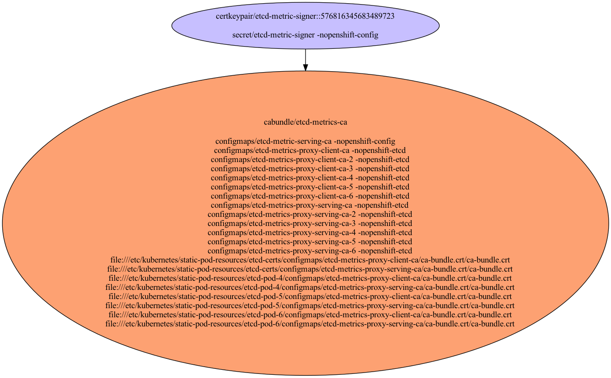

# etcd Metrics Certificates

Used to access etcd metrics using mTLS.

- [Signing Certificate/Key Pairs](#signing-certificatekey-pairs)
    - [etcd-metric-signer](#etcd-metric-signer)
- [Serving Certificate/Key Pairs](#serving-certificatekey-pairs)
    - [etcd-metrics-for-master-ci-ln-z2l4snt-f76d1-prqp5-master-2](#etcd-metrics-for-master-ci-ln-z2l4snt-f76d1-prqp5-master-2)
    - [etcd-metrics-for-master-ci-ln-z2l4snt-f76d1-prqp5-master-1](#etcd-metrics-for-master-ci-ln-z2l4snt-f76d1-prqp5-master-1)
    - [etcd-metrics-for-master-ci-ln-z2l4snt-f76d1-prqp5-master-0](#etcd-metrics-for-master-ci-ln-z2l4snt-f76d1-prqp5-master-0)
- [Client Certificate/Key Pairs](#client-certificatekey-pairs)
    - [etcd-metric](#etcd-metric)
    - [etcd-metrics-for-master-ci-ln-z2l4snt-f76d1-prqp5-master-2](#etcd-metrics-for-master-ci-ln-z2l4snt-f76d1-prqp5-master-2)
    - [etcd-metrics-for-master-ci-ln-z2l4snt-f76d1-prqp5-master-1](#etcd-metrics-for-master-ci-ln-z2l4snt-f76d1-prqp5-master-1)
    - [etcd-metrics-for-master-ci-ln-z2l4snt-f76d1-prqp5-master-0](#etcd-metrics-for-master-ci-ln-z2l4snt-f76d1-prqp5-master-0)
- [Certificates Without Keys](#certificates-without-keys)
- [Certificate Authority Bundles](#certificate-authority-bundles)
    - [etcd-metrics-ca](#etcd-metrics-ca)

## Signing Certificate/Key Pairs

### etcd-metric-signer

| Property | Value |
| ----------- | ----------- |
| Type | Signer |
| CommonName | etcd-metric-signer |
| SerialNumber | 4512145690115818224 |
| Issuer CommonName | [etcd-metric-signer](#etcd-metric-signer) |
| Validity | 10y |
| Signature Algorithm | SHA256-RSA |
| PublicKey Algorithm | RSA 2048 bit |
| Usages | - KeyUsageDigitalSignature - KeyUsageKeyEncipherment - KeyUsageCertSign |
| ExtendedUsages |  |

#### etcd-metric-signer Locations
| Namespace | Secret Name |
| ----------- | ----------- |
| openshift-config | etcd-metric-signer |

| File | Permissions | User | Group | SE Linux |
| ----------- | ----------- | ----------- | ----------- | ----------- |

## Serving Certificate/Key Pairs

### etcd-metrics-for-master-ci-ln-z2l4snt-f76d1-prqp5-master-2

| Property | Value |
| ----------- | ----------- |
| Type | Serving,Client |
| CommonName | system:etcd-metric:etcd-client |
| SerialNumber | 6358866917968328219 |
| Issuer CommonName | [etcd-metric-signer](#etcd-metric-signer) |
| Validity | 3y |
| Signature Algorithm | SHA256-RSA |
| PublicKey Algorithm | RSA 2048 bit |
| Usages | - KeyUsageDigitalSignature - KeyUsageKeyEncipherment |
| ExtendedUsages | - ExtKeyUsageClientAuth - ExtKeyUsageServerAuth |
| Organizations (User Groups) | - system:etcd-metrics |
| DNS Names | - etcd.kube-system.svc - etcd.kube-system.svc.cluster.local - etcd.openshift-etcd.svc - etcd.openshift-etcd.svc.cluster.local - localhost - ::1 - 10.0.0.5 - 127.0.0.1 - ::1 |
| IP Addresses | - ::1 - 10.0.0.5 - 127.0.0.1 - ::1 |

#### etcd-metrics-for-master-ci-ln-z2l4snt-f76d1-prqp5-master-2 Locations
| Namespace | Secret Name |
| ----------- | ----------- |
| openshift-etcd | etcd-serving-metrics-ci-ln-z2l4snt-f76d1-prqp5-master-2 |

| File | Permissions | User | Group | SE Linux |
| ----------- | ----------- | ----------- | ----------- | ----------- |
| /etc/kubernetes/static-pod-resources/etcd-certs/secrets/etcd-all-serving-metrics/etcd-serving-metrics-ci-ln-z2l4snt-f76d1-prqp5-master-2.crt/etcd-serving-metrics-ci-ln-z2l4snt-f76d1-prqp5-master-2.crt | -rw-------. | root | root | system_u:object_r:kubernetes_file_t:s0 |
| /etc/kubernetes/static-pod-resources/etcd-certs/secrets/etcd-all-serving-metrics/etcd-serving-metrics-ci-ln-z2l4snt-f76d1-prqp5-master-2.crt/etcd-serving-metrics-ci-ln-z2l4snt-f76d1-prqp5-master-2.key | -rw-------. | root | root | system_u:object_r:kubernetes_file_t:s0 |
| /etc/kubernetes/static-pod-resources/etcd-pod-2/secrets/etcd-all-serving-metrics/etcd-serving-metrics-ci-ln-z2l4snt-f76d1-prqp5-master-2.crt/etcd-serving-metrics-ci-ln-z2l4snt-f76d1-prqp5-master-2.crt | -rw-------. | root | root | system_u:object_r:kubernetes_file_t:s0 |
| /etc/kubernetes/static-pod-resources/etcd-pod-2/secrets/etcd-all-serving-metrics/etcd-serving-metrics-ci-ln-z2l4snt-f76d1-prqp5-master-2.crt/etcd-serving-metrics-ci-ln-z2l4snt-f76d1-prqp5-master-2.key | -rw-------. | root | root | system_u:object_r:kubernetes_file_t:s0 |
| /etc/kubernetes/static-pod-resources/etcd-pod-3/secrets/etcd-all-serving-metrics/etcd-serving-metrics-ci-ln-z2l4snt-f76d1-prqp5-master-2.crt/etcd-serving-metrics-ci-ln-z2l4snt-f76d1-prqp5-master-2.crt | -rw-------. | root | root | system_u:object_r:kubernetes_file_t:s0 |
| /etc/kubernetes/static-pod-resources/etcd-pod-3/secrets/etcd-all-serving-metrics/etcd-serving-metrics-ci-ln-z2l4snt-f76d1-prqp5-master-2.crt/etcd-serving-metrics-ci-ln-z2l4snt-f76d1-prqp5-master-2.key | -rw-------. | root | root | system_u:object_r:kubernetes_file_t:s0 |

### etcd-metrics-for-master-ci-ln-z2l4snt-f76d1-prqp5-master-1

| Property | Value |
| ----------- | ----------- |
| Type | Serving,Client |
| CommonName | system:etcd-metric:etcd-client |
| SerialNumber | 60420148563203057 |
| Issuer CommonName | [etcd-metric-signer](#etcd-metric-signer) |
| Validity | 3y |
| Signature Algorithm | SHA256-RSA |
| PublicKey Algorithm | RSA 2048 bit |
| Usages | - KeyUsageDigitalSignature - KeyUsageKeyEncipherment |
| ExtendedUsages | - ExtKeyUsageClientAuth - ExtKeyUsageServerAuth |
| Organizations (User Groups) | - system:etcd-metrics |
| DNS Names | - etcd.kube-system.svc - etcd.kube-system.svc.cluster.local - etcd.openshift-etcd.svc - etcd.openshift-etcd.svc.cluster.local - localhost - ::1 - 10.0.0.3 - 127.0.0.1 - ::1 |
| IP Addresses | - ::1 - 10.0.0.3 - 127.0.0.1 - ::1 |

#### etcd-metrics-for-master-ci-ln-z2l4snt-f76d1-prqp5-master-1 Locations
| Namespace | Secret Name |
| ----------- | ----------- |
| openshift-etcd | etcd-serving-metrics-ci-ln-z2l4snt-f76d1-prqp5-master-1 |

| File | Permissions | User | Group | SE Linux |
| ----------- | ----------- | ----------- | ----------- | ----------- |
| /etc/kubernetes/static-pod-resources/etcd-certs/secrets/etcd-all-serving-metrics/etcd-serving-metrics-ci-ln-z2l4snt-f76d1-prqp5-master-1.crt/etcd-serving-metrics-ci-ln-z2l4snt-f76d1-prqp5-master-1.crt | -rw-------. | root | root | system_u:object_r:kubernetes_file_t:s0 |
| /etc/kubernetes/static-pod-resources/etcd-certs/secrets/etcd-all-serving-metrics/etcd-serving-metrics-ci-ln-z2l4snt-f76d1-prqp5-master-1.crt/etcd-serving-metrics-ci-ln-z2l4snt-f76d1-prqp5-master-1.key | -rw-------. | root | root | system_u:object_r:kubernetes_file_t:s0 |
| /etc/kubernetes/static-pod-resources/etcd-pod-2/secrets/etcd-all-serving-metrics/etcd-serving-metrics-ci-ln-z2l4snt-f76d1-prqp5-master-1.crt/etcd-serving-metrics-ci-ln-z2l4snt-f76d1-prqp5-master-1.crt | -rw-------. | root | root | system_u:object_r:kubernetes_file_t:s0 |
| /etc/kubernetes/static-pod-resources/etcd-pod-2/secrets/etcd-all-serving-metrics/etcd-serving-metrics-ci-ln-z2l4snt-f76d1-prqp5-master-1.crt/etcd-serving-metrics-ci-ln-z2l4snt-f76d1-prqp5-master-1.key | -rw-------. | root | root | system_u:object_r:kubernetes_file_t:s0 |
| /etc/kubernetes/static-pod-resources/etcd-pod-3/secrets/etcd-all-serving-metrics/etcd-serving-metrics-ci-ln-z2l4snt-f76d1-prqp5-master-1.crt/etcd-serving-metrics-ci-ln-z2l4snt-f76d1-prqp5-master-1.crt | -rw-------. | root | root | system_u:object_r:kubernetes_file_t:s0 |
| /etc/kubernetes/static-pod-resources/etcd-pod-3/secrets/etcd-all-serving-metrics/etcd-serving-metrics-ci-ln-z2l4snt-f76d1-prqp5-master-1.crt/etcd-serving-metrics-ci-ln-z2l4snt-f76d1-prqp5-master-1.key | -rw-------. | root | root | system_u:object_r:kubernetes_file_t:s0 |

### etcd-metrics-for-master-ci-ln-z2l4snt-f76d1-prqp5-master-0

| Property | Value |
| ----------- | ----------- |
| Type | Serving,Client |
| CommonName | system:etcd-metric:etcd-client |
| SerialNumber | 4551946243516490096 |
| Issuer CommonName | [etcd-metric-signer](#etcd-metric-signer) |
| Validity | 3y |
| Signature Algorithm | SHA256-RSA |
| PublicKey Algorithm | RSA 2048 bit |
| Usages | - KeyUsageDigitalSignature - KeyUsageKeyEncipherment |
| ExtendedUsages | - ExtKeyUsageClientAuth - ExtKeyUsageServerAuth |
| Organizations (User Groups) | - system:etcd-metrics |
| DNS Names | - etcd.kube-system.svc - etcd.kube-system.svc.cluster.local - etcd.openshift-etcd.svc - etcd.openshift-etcd.svc.cluster.local - localhost - ::1 - 10.0.0.4 - 127.0.0.1 - ::1 |
| IP Addresses | - ::1 - 10.0.0.4 - 127.0.0.1 - ::1 |

#### etcd-metrics-for-master-ci-ln-z2l4snt-f76d1-prqp5-master-0 Locations
| Namespace | Secret Name |
| ----------- | ----------- |
| openshift-etcd | etcd-serving-metrics-ci-ln-z2l4snt-f76d1-prqp5-master-0 |

| File | Permissions | User | Group | SE Linux |
| ----------- | ----------- | ----------- | ----------- | ----------- |
| /etc/kubernetes/static-pod-resources/etcd-certs/secrets/etcd-all-serving-metrics/etcd-serving-metrics-ci-ln-z2l4snt-f76d1-prqp5-master-0.crt/etcd-serving-metrics-ci-ln-z2l4snt-f76d1-prqp5-master-0.crt | -rw-------. | root | root | system_u:object_r:kubernetes_file_t:s0 |
| /etc/kubernetes/static-pod-resources/etcd-certs/secrets/etcd-all-serving-metrics/etcd-serving-metrics-ci-ln-z2l4snt-f76d1-prqp5-master-0.crt/etcd-serving-metrics-ci-ln-z2l4snt-f76d1-prqp5-master-0.key | -rw-------. | root | root | system_u:object_r:kubernetes_file_t:s0 |
| /etc/kubernetes/static-pod-resources/etcd-pod-2/secrets/etcd-all-serving-metrics/etcd-serving-metrics-ci-ln-z2l4snt-f76d1-prqp5-master-0.crt/etcd-serving-metrics-ci-ln-z2l4snt-f76d1-prqp5-master-0.crt | -rw-------. | root | root | system_u:object_r:kubernetes_file_t:s0 |
| /etc/kubernetes/static-pod-resources/etcd-pod-2/secrets/etcd-all-serving-metrics/etcd-serving-metrics-ci-ln-z2l4snt-f76d1-prqp5-master-0.crt/etcd-serving-metrics-ci-ln-z2l4snt-f76d1-prqp5-master-0.key | -rw-------. | root | root | system_u:object_r:kubernetes_file_t:s0 |
| /etc/kubernetes/static-pod-resources/etcd-pod-3/secrets/etcd-all-serving-metrics/etcd-serving-metrics-ci-ln-z2l4snt-f76d1-prqp5-master-0.crt/etcd-serving-metrics-ci-ln-z2l4snt-f76d1-prqp5-master-0.crt | -rw-------. | root | root | system_u:object_r:kubernetes_file_t:s0 |
| /etc/kubernetes/static-pod-resources/etcd-pod-3/secrets/etcd-all-serving-metrics/etcd-serving-metrics-ci-ln-z2l4snt-f76d1-prqp5-master-0.crt/etcd-serving-metrics-ci-ln-z2l4snt-f76d1-prqp5-master-0.key | -rw-------. | root | root | system_u:object_r:kubernetes_file_t:s0 |

## Client Certificate/Key Pairs

### etcd-metric

| Property | Value |
| ----------- | ----------- |
| Type | Client |
| CommonName | etcd-metric |
| SerialNumber | 381254556453658027 |
| Issuer CommonName | [etcd-metric-signer](#etcd-metric-signer) |
| Validity | 10y |
| Signature Algorithm | SHA256-RSA |
| PublicKey Algorithm | RSA 2048 bit |
| Usages | - KeyUsageDigitalSignature - KeyUsageKeyEncipherment |
| ExtendedUsages | - ExtKeyUsageClientAuth |
| Organizations (User Groups) |  |

#### etcd-metric Locations
| Namespace | Secret Name |
| ----------- | ----------- |
| openshift-config | etcd-metric-client |

| File | Permissions | User | Group | SE Linux |
| ----------- | ----------- | ----------- | ----------- | ----------- |

### etcd-metrics-for-master-ci-ln-z2l4snt-f76d1-prqp5-master-2

| Property | Value |
| ----------- | ----------- |
| Type | Serving,Client |
| CommonName | system:etcd-metric:etcd-client |
| SerialNumber | 6358866917968328219 |
| Issuer CommonName | [etcd-metric-signer](#etcd-metric-signer) |
| Validity | 3y |
| Signature Algorithm | SHA256-RSA |
| PublicKey Algorithm | RSA 2048 bit |
| Usages | - KeyUsageDigitalSignature - KeyUsageKeyEncipherment |
| ExtendedUsages | - ExtKeyUsageClientAuth - ExtKeyUsageServerAuth |
| Organizations (User Groups) | - system:etcd-metrics |
| DNS Names | - etcd.kube-system.svc - etcd.kube-system.svc.cluster.local - etcd.openshift-etcd.svc - etcd.openshift-etcd.svc.cluster.local - localhost - ::1 - 10.0.0.5 - 127.0.0.1 - ::1 |
| IP Addresses | - ::1 - 10.0.0.5 - 127.0.0.1 - ::1 |

#### etcd-metrics-for-master-ci-ln-z2l4snt-f76d1-prqp5-master-2 Locations
| Namespace | Secret Name |
| ----------- | ----------- |
| openshift-etcd | etcd-serving-metrics-ci-ln-z2l4snt-f76d1-prqp5-master-2 |

| File | Permissions | User | Group | SE Linux |
| ----------- | ----------- | ----------- | ----------- | ----------- |
| /etc/kubernetes/static-pod-resources/etcd-certs/secrets/etcd-all-serving-metrics/etcd-serving-metrics-ci-ln-z2l4snt-f76d1-prqp5-master-2.crt/etcd-serving-metrics-ci-ln-z2l4snt-f76d1-prqp5-master-2.crt | -rw-------. | root | root | system_u:object_r:kubernetes_file_t:s0 |
| /etc/kubernetes/static-pod-resources/etcd-certs/secrets/etcd-all-serving-metrics/etcd-serving-metrics-ci-ln-z2l4snt-f76d1-prqp5-master-2.crt/etcd-serving-metrics-ci-ln-z2l4snt-f76d1-prqp5-master-2.key | -rw-------. | root | root | system_u:object_r:kubernetes_file_t:s0 |
| /etc/kubernetes/static-pod-resources/etcd-pod-2/secrets/etcd-all-serving-metrics/etcd-serving-metrics-ci-ln-z2l4snt-f76d1-prqp5-master-2.crt/etcd-serving-metrics-ci-ln-z2l4snt-f76d1-prqp5-master-2.crt | -rw-------. | root | root | system_u:object_r:kubernetes_file_t:s0 |
| /etc/kubernetes/static-pod-resources/etcd-pod-2/secrets/etcd-all-serving-metrics/etcd-serving-metrics-ci-ln-z2l4snt-f76d1-prqp5-master-2.crt/etcd-serving-metrics-ci-ln-z2l4snt-f76d1-prqp5-master-2.key | -rw-------. | root | root | system_u:object_r:kubernetes_file_t:s0 |
| /etc/kubernetes/static-pod-resources/etcd-pod-3/secrets/etcd-all-serving-metrics/etcd-serving-metrics-ci-ln-z2l4snt-f76d1-prqp5-master-2.crt/etcd-serving-metrics-ci-ln-z2l4snt-f76d1-prqp5-master-2.crt | -rw-------. | root | root | system_u:object_r:kubernetes_file_t:s0 |
| /etc/kubernetes/static-pod-resources/etcd-pod-3/secrets/etcd-all-serving-metrics/etcd-serving-metrics-ci-ln-z2l4snt-f76d1-prqp5-master-2.crt/etcd-serving-metrics-ci-ln-z2l4snt-f76d1-prqp5-master-2.key | -rw-------. | root | root | system_u:object_r:kubernetes_file_t:s0 |

### etcd-metrics-for-master-ci-ln-z2l4snt-f76d1-prqp5-master-1

| Property | Value |
| ----------- | ----------- |
| Type | Serving,Client |
| CommonName | system:etcd-metric:etcd-client |
| SerialNumber | 60420148563203057 |
| Issuer CommonName | [etcd-metric-signer](#etcd-metric-signer) |
| Validity | 3y |
| Signature Algorithm | SHA256-RSA |
| PublicKey Algorithm | RSA 2048 bit |
| Usages | - KeyUsageDigitalSignature - KeyUsageKeyEncipherment |
| ExtendedUsages | - ExtKeyUsageClientAuth - ExtKeyUsageServerAuth |
| Organizations (User Groups) | - system:etcd-metrics |
| DNS Names | - etcd.kube-system.svc - etcd.kube-system.svc.cluster.local - etcd.openshift-etcd.svc - etcd.openshift-etcd.svc.cluster.local - localhost - ::1 - 10.0.0.3 - 127.0.0.1 - ::1 |
| IP Addresses | - ::1 - 10.0.0.3 - 127.0.0.1 - ::1 |

#### etcd-metrics-for-master-ci-ln-z2l4snt-f76d1-prqp5-master-1 Locations
| Namespace | Secret Name |
| ----------- | ----------- |
| openshift-etcd | etcd-serving-metrics-ci-ln-z2l4snt-f76d1-prqp5-master-1 |

| File | Permissions | User | Group | SE Linux |
| ----------- | ----------- | ----------- | ----------- | ----------- |
| /etc/kubernetes/static-pod-resources/etcd-certs/secrets/etcd-all-serving-metrics/etcd-serving-metrics-ci-ln-z2l4snt-f76d1-prqp5-master-1.crt/etcd-serving-metrics-ci-ln-z2l4snt-f76d1-prqp5-master-1.crt | -rw-------. | root | root | system_u:object_r:kubernetes_file_t:s0 |
| /etc/kubernetes/static-pod-resources/etcd-certs/secrets/etcd-all-serving-metrics/etcd-serving-metrics-ci-ln-z2l4snt-f76d1-prqp5-master-1.crt/etcd-serving-metrics-ci-ln-z2l4snt-f76d1-prqp5-master-1.key | -rw-------. | root | root | system_u:object_r:kubernetes_file_t:s0 |
| /etc/kubernetes/static-pod-resources/etcd-pod-2/secrets/etcd-all-serving-metrics/etcd-serving-metrics-ci-ln-z2l4snt-f76d1-prqp5-master-1.crt/etcd-serving-metrics-ci-ln-z2l4snt-f76d1-prqp5-master-1.crt | -rw-------. | root | root | system_u:object_r:kubernetes_file_t:s0 |
| /etc/kubernetes/static-pod-resources/etcd-pod-2/secrets/etcd-all-serving-metrics/etcd-serving-metrics-ci-ln-z2l4snt-f76d1-prqp5-master-1.crt/etcd-serving-metrics-ci-ln-z2l4snt-f76d1-prqp5-master-1.key | -rw-------. | root | root | system_u:object_r:kubernetes_file_t:s0 |
| /etc/kubernetes/static-pod-resources/etcd-pod-3/secrets/etcd-all-serving-metrics/etcd-serving-metrics-ci-ln-z2l4snt-f76d1-prqp5-master-1.crt/etcd-serving-metrics-ci-ln-z2l4snt-f76d1-prqp5-master-1.crt | -rw-------. | root | root | system_u:object_r:kubernetes_file_t:s0 |
| /etc/kubernetes/static-pod-resources/etcd-pod-3/secrets/etcd-all-serving-metrics/etcd-serving-metrics-ci-ln-z2l4snt-f76d1-prqp5-master-1.crt/etcd-serving-metrics-ci-ln-z2l4snt-f76d1-prqp5-master-1.key | -rw-------. | root | root | system_u:object_r:kubernetes_file_t:s0 |

### etcd-metrics-for-master-ci-ln-z2l4snt-f76d1-prqp5-master-0

| Property | Value |
| ----------- | ----------- |
| Type | Serving,Client |
| CommonName | system:etcd-metric:etcd-client |
| SerialNumber | 4551946243516490096 |
| Issuer CommonName | [etcd-metric-signer](#etcd-metric-signer) |
| Validity | 3y |
| Signature Algorithm | SHA256-RSA |
| PublicKey Algorithm | RSA 2048 bit |
| Usages | - KeyUsageDigitalSignature - KeyUsageKeyEncipherment |
| ExtendedUsages | - ExtKeyUsageClientAuth - ExtKeyUsageServerAuth |
| Organizations (User Groups) | - system:etcd-metrics |
| DNS Names | - etcd.kube-system.svc - etcd.kube-system.svc.cluster.local - etcd.openshift-etcd.svc - etcd.openshift-etcd.svc.cluster.local - localhost - ::1 - 10.0.0.4 - 127.0.0.1 - ::1 |
| IP Addresses | - ::1 - 10.0.0.4 - 127.0.0.1 - ::1 |

#### etcd-metrics-for-master-ci-ln-z2l4snt-f76d1-prqp5-master-0 Locations
| Namespace | Secret Name |
| ----------- | ----------- |
| openshift-etcd | etcd-serving-metrics-ci-ln-z2l4snt-f76d1-prqp5-master-0 |

| File | Permissions | User | Group | SE Linux |
| ----------- | ----------- | ----------- | ----------- | ----------- |
| /etc/kubernetes/static-pod-resources/etcd-certs/secrets/etcd-all-serving-metrics/etcd-serving-metrics-ci-ln-z2l4snt-f76d1-prqp5-master-0.crt/etcd-serving-metrics-ci-ln-z2l4snt-f76d1-prqp5-master-0.crt | -rw-------. | root | root | system_u:object_r:kubernetes_file_t:s0 |
| /etc/kubernetes/static-pod-resources/etcd-certs/secrets/etcd-all-serving-metrics/etcd-serving-metrics-ci-ln-z2l4snt-f76d1-prqp5-master-0.crt/etcd-serving-metrics-ci-ln-z2l4snt-f76d1-prqp5-master-0.key | -rw-------. | root | root | system_u:object_r:kubernetes_file_t:s0 |
| /etc/kubernetes/static-pod-resources/etcd-pod-2/secrets/etcd-all-serving-metrics/etcd-serving-metrics-ci-ln-z2l4snt-f76d1-prqp5-master-0.crt/etcd-serving-metrics-ci-ln-z2l4snt-f76d1-prqp5-master-0.crt | -rw-------. | root | root | system_u:object_r:kubernetes_file_t:s0 |
| /etc/kubernetes/static-pod-resources/etcd-pod-2/secrets/etcd-all-serving-metrics/etcd-serving-metrics-ci-ln-z2l4snt-f76d1-prqp5-master-0.crt/etcd-serving-metrics-ci-ln-z2l4snt-f76d1-prqp5-master-0.key | -rw-------. | root | root | system_u:object_r:kubernetes_file_t:s0 |
| /etc/kubernetes/static-pod-resources/etcd-pod-3/secrets/etcd-all-serving-metrics/etcd-serving-metrics-ci-ln-z2l4snt-f76d1-prqp5-master-0.crt/etcd-serving-metrics-ci-ln-z2l4snt-f76d1-prqp5-master-0.crt | -rw-------. | root | root | system_u:object_r:kubernetes_file_t:s0 |
| /etc/kubernetes/static-pod-resources/etcd-pod-3/secrets/etcd-all-serving-metrics/etcd-serving-metrics-ci-ln-z2l4snt-f76d1-prqp5-master-0.crt/etcd-serving-metrics-ci-ln-z2l4snt-f76d1-prqp5-master-0.key | -rw-------. | root | root | system_u:object_r:kubernetes_file_t:s0 |

## Certificates Without Keys

These certificates are present in certificate authority bundles, but do not have keys in the cluster.
This happens when the installer bootstrap clusters with a set of certificate/key pairs that are deleted during the
installation process.

## Certificate Authority Bundles

### etcd-metrics-ca

CA used to recognize etcd metrics serving and client certificates.

**Bundled Certificates**

| CommonName | Issuer CommonName | Validity | PublicKey Algorithm |
| ----------- | ----------- | ----------- | ----------- |
| [etcd-metric-signer](#etcd-metric-signer) | [etcd-metric-signer](#etcd-metric-signer) | 10y | RSA 2048 bit |

#### etcd-metrics-ca Locations
| Namespace | ConfigMap Name |
| ----------- | ----------- |
| openshift-config | etcd-metric-serving-ca |
| openshift-etcd | etcd-metrics-proxy-client-ca |
| openshift-etcd | etcd-metrics-proxy-client-ca-2 |
| openshift-etcd | etcd-metrics-proxy-client-ca-3 |
| openshift-etcd | etcd-metrics-proxy-serving-ca |
| openshift-etcd | etcd-metrics-proxy-serving-ca-2 |
| openshift-etcd | etcd-metrics-proxy-serving-ca-3 |

| File | Permissions | User | Group | SE Linux |
| ----------- | ----------- | ----------- | ----------- | ----------- |
| /etc/kubernetes/static-pod-resources/etcd-certs/configmaps/etcd-metrics-proxy-client-ca/ca-bundle.crt/ca-bundle.crt | -rw-r--r--. | root | root | system_u:object_r:kubernetes_file_t:s0 |
| /etc/kubernetes/static-pod-resources/etcd-certs/configmaps/etcd-metrics-proxy-serving-ca/ca-bundle.crt/ca-bundle.crt | -rw-r--r--. | root | root | system_u:object_r:kubernetes_file_t:s0 |
| /etc/kubernetes/static-pod-resources/etcd-pod-2/configmaps/etcd-metrics-proxy-client-ca/ca-bundle.crt/ca-bundle.crt | -rw-r--r--. | root | root | system_u:object_r:kubernetes_file_t:s0 |
| /etc/kubernetes/static-pod-resources/etcd-pod-2/configmaps/etcd-metrics-proxy-serving-ca/ca-bundle.crt/ca-bundle.crt | -rw-r--r--. | root | root | system_u:object_r:kubernetes_file_t:s0 |
| /etc/kubernetes/static-pod-resources/etcd-pod-3/configmaps/etcd-metrics-proxy-client-ca/ca-bundle.crt/ca-bundle.crt | -rw-r--r--. | root | root | system_u:object_r:kubernetes_file_t:s0 |
| /etc/kubernetes/static-pod-resources/etcd-pod-3/configmaps/etcd-metrics-proxy-serving-ca/ca-bundle.crt/ca-bundle.crt | -rw-r--r--. | root | root | system_u:object_r:kubernetes_file_t:s0 |

